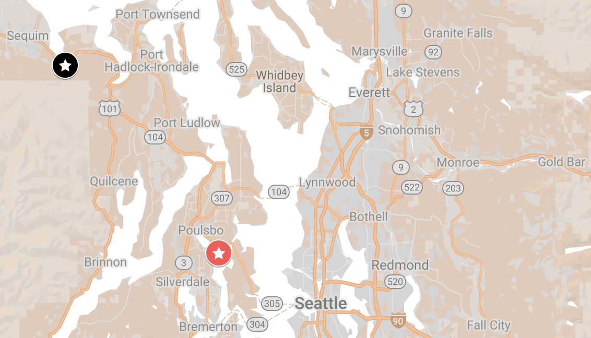
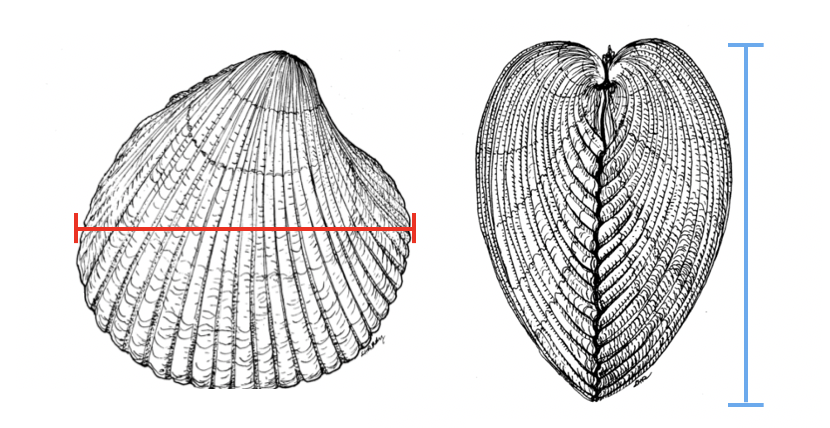
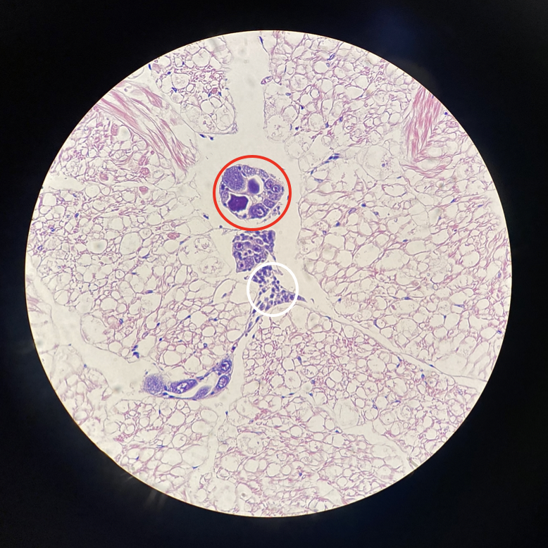
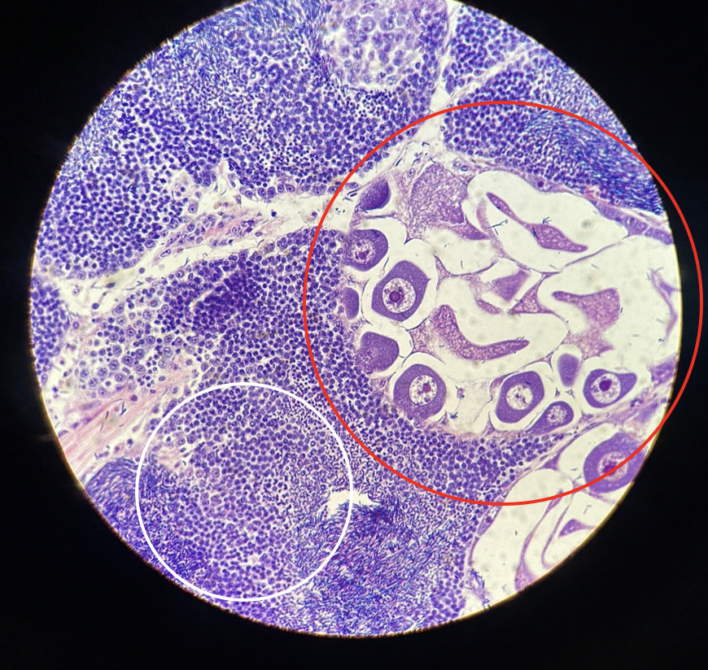
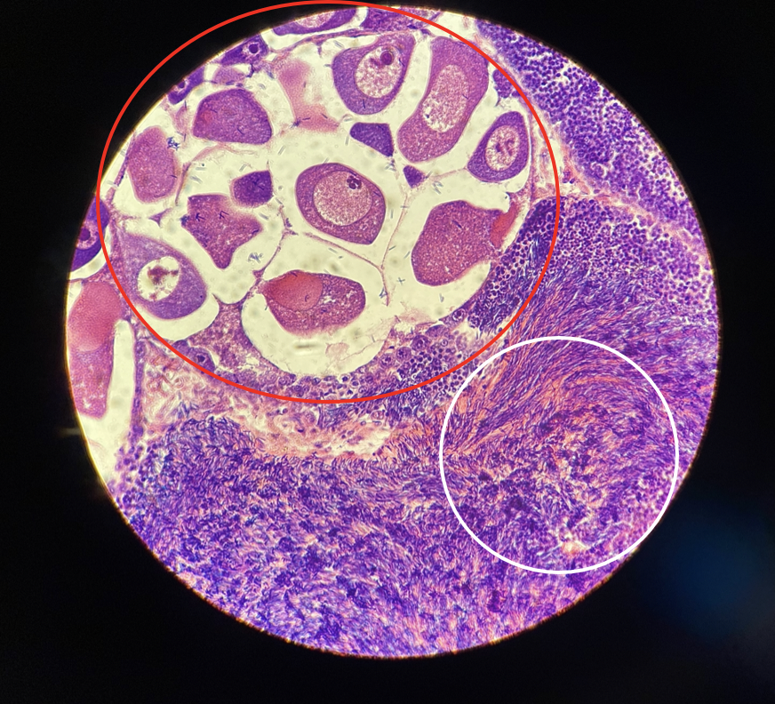
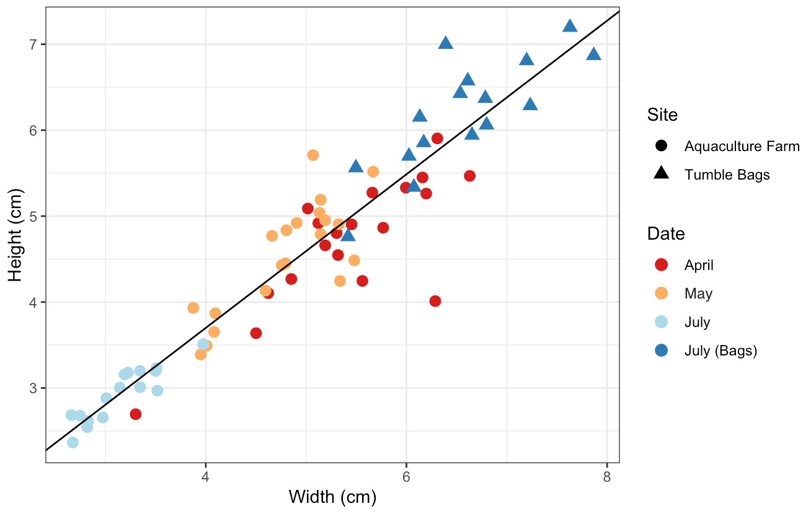
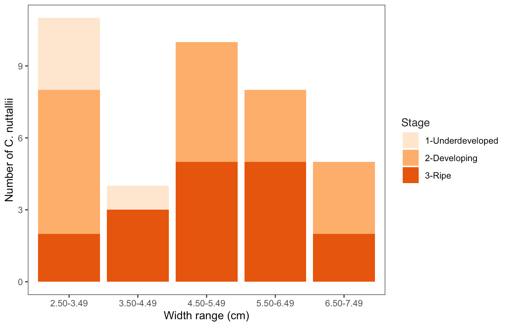

::: {.callout-warning}
## Status

This report is a Roberts Lab working manuscript. It has not been peer reviewed.

It is shared to make small scientific efforts, preliminary analyses, technical observations, and exploratory work openly available.
:::

## Abstract

*Clinocardium nuttallii*, the basket cockle, is a bivalve species that exhibits simultaneous hermaphroditism and is native to the Pacific Northwest region. This study analyzed the relationship between *C. nuttallii* size and gonad stage, and the seasonal maturation of *C. nuttallii* individuals collected from the waters of Washington state. The purpose of this study was to provide information for future aquaculture activities. *C. nuttallii* were collected from two locations between the months of April and July, with morphometric data and gonad samples collected. Gonad samples were analyzed to determine the reproductive maturity of male and female gonads. Larger *C. nuttallii* (>3.50 cm) were seen to exhibit more developed gonads, and male and female gonads exhibited more uniform maturity within an individual as size increased. Seasonality was not correlated with gonad maturity. Based on our observations, it is unlikely that cockles collected for this study had recently spawned, suggesting that cockles collected during this time would be good prospects for broodstock selection and induced spawning.

**Keywords:** Bivalve gonad, Bivalve aquaculture, Simultaneous hermaphroditism, Pacific Northwest, Hematoxylin & Eosin staining

## Background

Bivalves are an important resource in the Pacific Northwest, both commercially and culturally [@shellfish2020washington; @weinberger2019sustenance]. Within the Pacific Northwest region, commercial bivalve aquaculture is practiced primarily in the state of Washington [@yang2019molluscan]. Aquaculture is a useful practice as it is both profitable and can decrease harvesting stress on natural populations, which in turn contributes to conservation and food production [@yang2019molluscan; @froehlich2017conservation]. These contributions can be observed through the use of aquaculture by the Suquamish tribe, a coastal Salish tribe based in the state of Washington. The tribe began growing *Clinocardium nuttallii*, the basket cockle, as a culturally significant food source on an aquaculture farm when elders noticed that the natural abundance of *C. nuttallii* was declining [@weinberger2019sustenance]. The tribe partnered with the Puget Sound Restoration Fund in order to grow these cockles [@weinberger2019sustenance], and this aquaculture practice was used to decrease pressure on the natural populations of *C. nuttallii* in order to reinstate the bivalve as an accessible food source for the tribe.

The natural range of *C. nuttallii* spans along the west coast of North America, from San Diego, CA to the coast of Alaska [@clinocardium2016profile]. Basket cockles can be found living at the surface or directly below the surface of sediment, usually in the intertidal zone [@gallucci1982reproduction]. This species consists of simultaneous hermaphrodites, meaning that the organisms exhibit both male and female gametes at the same time throughout their lives [@gallucci1982reproduction]. In a study conducted by @gallucci1982reproduction, the reproductive profiles of basket cockles collected from Garrison Bay, WA were studied. This analysis determined that gametogenesis in *C. nuttallii* occurred from October to June, and that spawning occurred between the months of April and November, with the majority occurring after the month of July [@gallucci1982reproduction]. Additionally, in a majority of cases, Garrison Bay *C. nuttallii* were observed to exhibit developed gonads in the second year of life (5.40–6.69 cm), with only a few first-year cockles exhibiting developed gonads (3.43–5.03 cm) [@gallucci1982reproduction].

While @gallucci1982reproduction analyzed the reproductive profiles of *C. nuttallii* collected from Garrison Bay, there is likely variation between those organisms and the population that will be analyzed in this study [@newell1982temporal]. In order to yield the most successful aquaculture practices, the reproductive profile of a species needs to be fully studied and understood, meaning that an aquaculture practice based on the reproductive profiles of a different population of *C. nuttallii* may not be sufficient [@kagawa2005first]. For this reason, the gonad maturation of the basket cockle population in our field of study needed to be analyzed. The goals of this study were to determine the relationship between *C. nuttallii* size (cm) and gonad stage, and *C. nuttallii* seasonal maturation. These results will provide valuable information for future broodstock development, including induced spawning events.

## Methods

### Sample Collection

Fifty-eight *Clinocardium nuttallii* were collected from geoduck tubes on an aquaculture farm in Blyn, WA over the course of three low tide events. The first in April, the second in May, and the third in July. A fourth sample of 20 cockles was collected from the Suquamish tribe in July. These cockles were being harvested in tumble-bags instead of geoduck tubes. Detailed sampling information can be seen in the tables and figure below (@tbl-sampling, @tbl-collection, @fig-map).

: Sampling dates, locations, and location types for the samples collected. {#tbl-sampling}

| Sampling Date | Location | Coordinates | Location Type |
|---|---|---|---|
| April 10, 2020 | Blyn, WA | 48.02662, -123.00499 | Aquaculture farm |
| May 11, 2020 | Blyn, WA | 48.02662, -123.00499 | Aquaculture farm |
| July 6, 2020 | Blyn, WA | 48.02662, -123.00499 | Aquaculture farm |
| July 8, 2020 | Suquamish Tribe | 47.69536, -122.60283 | Tumble Bags |

{#fig-map}

: Details regarding the collection of *C. nuttallii* from the aquaculture farm in Blyn, WA. {#tbl-collection}

| Sampling date | Diameter of geoduck tube | *C. nuttallii* density per tube | Number of *C. nuttallii* collected |
|---|---|---|---|
| April 10, 2020 | 4–6" | 1–4 | 20 |
| May 11, 2020 | 4" | 1–2 | 20 |
| July 6, 2020 | 4" | 1–2 | 18 |

Only one *C. nuttallii* was collected from each geoduck tube. The smaller sample size for the July 6 sampling event is a result of geoduck tubes being unexpectedly removed from the aquaculture farm, resulting in a smaller sampling area and the inability to find 20 live *C. nuttallii* within the remaining tubes.

### Morphometrics

Pictures were taken of each *C. nuttallii* before dissection, and ImageJ was used to measure the height (cm) and width (cm) of each cockle (@fig-measure). Gonad samples were collected by opening the shells and collecting ovary and testes tissue. The samples were then placed into a cassette and stored in formaldehyde and seawater. Cassettes were sent to a histology lab for Hematoxylin and Eosin (H & E) staining. The number of cockles from which gonads were H & E stained differed by sampling date (@tbl-stained).

: Number of cockles H & E stained by sampling date and location. {#tbl-stained}

| Sampling Date | Location | Number of cockles H & E stained |
|---|---|---|
| April 10, 2020 | Blyn, WA | 9 |
| May 11, 2020 | Blyn, WA | 8 |
| July 6, 2020 | Blyn, WA | 20 |
| July 8, 2020 | Suquamish Tribe | 8 |

{#fig-measure}

*C. nuttallii* size was also used to predict the age of the individual. Predicted age is based on information obtained from @gallucci1982reproduction, which listed age groups by size (cm) (1 year: 3.43–5.03 cm, 2 years: 5.40–6.95 cm, 3 years: 6.54–7.68 cm). Cockles with a width smaller than the size range listed for one year of age were predicted to be less than 1 year old, and all cockles with a width larger than 6.54 cm were assumed to be 3 years old.

### Histology

Maturity was determined using stained samples based on methods employed by @gallucci1982reproduction, using an ordinal scale from 1 to 5 (@tbl-grades). Histological analysis included observations of gonadal tissue under 4x, 10x, and 40x magnifications, and images were taken at each magnification in order to facilitate staging (@fig-stage1, @fig-stage2, @fig-stage3).

: Histological appearance of 5 grades of gonads in *Clinocardium nuttallii*. Adopted from @gallucci1982reproduction. {#tbl-grades}

| Grade | Female Gonadal Tissue | Male Gonadal Tissue |
|---|---|---|
| Grade 1 | Both oogonia and a few oocytes lined the follicle. Follicles were generally collapsed. | Spermatogonia, primary and secondary spermatocytes partially lined the follicle wall. Follicles were generally collapsed. |
| Grade 2 | Developing gametes. Rounded oocytes along with many pear-shaped oocytes were attached to the follicle wall. One or 2 detached oocytes were present. The walls between some follicles were broken, so that these follicles appeared larger than in Grade 1 and the oocytes appeared more widely spaced. | Developing gametes. Spermatocytes and spermatids predominated. Less than one third of the follicle was filled with spermatozoa. |
| Grade 3 | Ripe. Some oocytes remained attached to the follicle wall. Many of the oocytes were free within the follicle. | Ripe. The follicle was more than two thirds full with spermatozoa. The spermatozoa were arranged in characteristic bands. |
| Grade 4 | Recently spawned. The follicle contained an occasional free oocyte, and moderate amounts of oocytes were still attached but many were undergoing karyolysis and cytolysis. | Recently spawned. The follicle was collapsed with some residual spermatozoa present in the lumen, and some spermatids were attached to the wall. |
| Grade 5 | At this stage it is difficult to distinguish the sexes. Follicles were collapsed. Rare residual spermatozoa and oocytes served to identify the sex of the follicle. Pigmented cells were present. | At this stage it is difficult to distinguish the sexes. Follicles were collapsed. Rare residual spermatozoa and oocytes served to identify the sex of the follicle. Pigmented cells were present. |

{#fig-stage1}

{#fig-stage2}

{#fig-stage3}

### Statistics

The widths of the cockles were analyzed by collection date using an ANOVA and Tukey test. The heights of the cockles were also analyzed by collection date using the same technique. The relationship between female gonad stage and collection date for the samples collected at the aquaculture farm was analyzed (Kruskal–Wallis test). The relationship between male gonad stage and collection date for the samples collected at the aquaculture farm was also analyzed (Kruskal–Wallis test). A Kruskal–Wallis test could not be performed on the sample collected from the Suquamish tribe tumble-bags due to the singular collection date. The Kruskal–Wallis test was chosen because the dependent variable (gonad stage) was ordinal and the independent variable (collection date) had 2 or more levels. Then, the relationship between width, height, and female gonad stage was analyzed for cockles across both sample sites (ordered logistic regression test). An ordered logistic regression test was performed because the dependent variable (gonad stage) was on an ordinal scale.

## Results

### Morphometrics

*C. nuttallii* width (cm) and height (cm) are strongly correlated (@fig-scatter), thus width (cm) was used for the remaining statistical analysis within the paper. Average *C. nuttallii* widths (cm) decreased as time progressed in the samples from the aquaculture farm, with April samples having the largest average width (5.43 cm), July samples having the smallest average width (3.15 cm), and May samples falling in between these values (4.80 cm) (@fig-scatter). This is likely due to the nature of random sampling, but small sizes in the month of July may be a result of the removal of geoduck tubes limiting sample collection.

{#fig-scatter}

Average *C. nuttallii* widths and heights differed significantly between each collection date (p = 2e-16, One-way ANOVA and Post Hoc Tukey test).

### Reproductive Maturation

#### Maturity at size

Stage 1 gonad was only observed within small *C. nuttallii*, ranging from 2.66 cm to 3.50 cm (underdeveloped, n = 4) (@fig-stage-width, @fig-stage-bar). Stage 3 (developed) gonad was observed across a width range of 3.22 cm to 6.63 cm (n = 16) (@fig-stage-width, @fig-stage-bar). At sizes greater than 3.50 cm, only stage 2 and 3 gonads were observed (@fig-stage-width, @fig-stage-bar). However, no significance was observed when the female gonad stage was analyzed against width (cm) (p = 0.079) and height (cm) (p = 0.188) together (Ordered Logistic Regression).

![Male gonad stage, female gonad stage, and width (cm) of each individual *C. nuttallii*. Each point represents one basket cockle, and the color of the point represents the width (cm) of the organism. A jitter is used in this plot in order to make individual cockles visible, since points would overlap naturally due to the ordinal scale used to stage gonads. The large points represent *C. nuttallii* individuals, and the small points represent the male and female gonad stage intersections around which the large points are centered.](figures/fig07-gonad-stage-width.png){#fig-stage-width}

{#fig-stage-bar}

#### Relative Maturity at size

Relative maturity refers to the male and female gonad being at equal stages within an individual *C. nuttallii*. In instances where the male and female gonad were at different stages within an individual basket cockle (10), the male gonad was more advanced than the female gonad in a majority of cases (7). This suggests that maturity of female gonads can be used to predict the maturity of all gonads, as if the female gonad has reached maturity it is likely that the male gonad has as well. This is consistent with the findings of @gallucci1982reproduction, as their study found that maturity of female and male gonads were largely equal within an individual.

In smaller basket cockles, such as those collected from the aquaculture farm in the month of July (n = 15) (2.66 cm – 3.97 cm), there is a large amount of variation between male and female gonad maturity (n = 5, 33%) (@fig-stage-width). In comparison, in larger basket cockles, such as those collected from the other three collection dates (n = 23) (4.60 cm – 7.20 cm), male and female gonads exhibited different stages in a lower percentage of *C. nuttallii* (n = 5, 22%) (@fig-stage-width).

#### Maturity at predicted age

*C. nuttallii* of predicted ages ranging from less than 1 year to 3 years old were seen exhibiting developed (stage 3) male and female gonads at the same time (@fig-stage-age). Out of these occurrences (n = 16), 2 were predicted to be less than 1 year old, 6 were predicted to be 1 year old, 6 were predicted to be 2 years old, and 2 were predicted to be 3 years old (@fig-stage-age). Additionally, only *C. nuttallii* predicted to be less than 1 year old exhibited gonad stages of 1 (underdeveloped) (@fig-stage-age). This once again shows a pattern of larger organisms exhibiting gonad stages 2 and 3, as predicted age range is based on cockle size [@gallucci1982reproduction].

![Male gonad stage, female gonad stage, and predicted *C. nuttallii* age. Each point represents one basket cockle, and the color of the point represents the predicted age of the organism. A jitter is used in this plot in order to make individual cockles visible, since points would overlap naturally due to the ordinal scale used to stage gonads. The large points represent *C. nuttallii* individuals, and the small points represent the male and female gonad stage intersections around which the large points are centered.](figures/fig09-gonad-stage-age.png){#fig-stage-age}

#### Seasonal maturity

Stages 1 (underdeveloped) to 3 (developed) were observed across the months of April to July, meaning that no collected *C. nuttallii* had recently spawned (stage 4) or were spent (stage 5). However, no significant difference was observed in *C. nuttallii* female gonad stage between collection dates (χ² = 3.39, p = 0.335, Kruskal–Wallis).

## Discussion

This study analyzed the relationship between *C. nuttallii* size and gonad stage, and the seasonal maturation of the species. There was a positive correlation observed between size and gonad stage. As *C. nuttallii* size increased across the sampled size range, more developed gonad stages were observed. This suggests that size would be a good predictor of maturity, and that organisms with a width larger than 3.50 cm could be induced to spawn under controlled aquaculture conditions. Additionally, as size increased, the relative maturity of male and female gonads increased, meaning that the stages of male and female gonads became more similar with size.

### Reproductive Development

Histological analysis of gonads was compared to *C. nuttallii* morphometrics in order to predict when spawning could be induced on an aquaculture farm. The data collected in this study suggest that *C. nuttallii* will likely exhibit female gonad maturity of stages 2 (developing) and 3 (developed) at widths larger than 3.50 cm in the months of April, May, and July. As the size of *C. nuttallii* collected in April falls above this range (5.017 – 6.631 cm), it is possible spawning could be successfully induced during this month. @gallucci1982reproduction determined the earliest spawning of the *C. nuttallii* analyzed in their study to be in the month of April, which aligns with the findings in this study. Per contra, @gallucci1982reproduction only observed stage 3 gonads (developed) in individuals of sizes larger than 5.59 cm, which indicates a difference between the populations analyzed in our studies. This may be a result of decreased pH in Puget Sound and Salish Sea waters in the year 2020 as compared to 1982 [@bianucci2018sensitivity]. These conditions lead to decreased availability of CaCO₃, which many bivalves including *C. nuttallii* use to create their shells [@bianucci2018sensitivity; @mohamed2012decomposition]. This decrease in CaCO₃ may have led to smaller *C. nuttallii* overall, meaning that as time progressed, smaller individuals likely started to become reproductively mature [@berge2006effects]. This pattern is likely to continue, as Puget Sound and Salish Sea pH is predicted to continue decreasing in the years to come [@dunagan2019rate].

When determining the best time to induce spawning, it is important to verify that *C. nuttallii* have not yet naturally spawned. The data collected in this study suggests it is likely that the months of April–July would be a good time to induce spawning in an aquaculture setting, as it avoids overlapping with natural spawning timing and ensures that induced individuals will not already be spent. @gallucci1982reproduction found that there were no ripe female or male gonads (stage 3) in the month of June. They state that this suggests a small spawning peak in the months of April and May, and a larger spawning peak in the months of July through September [@gallucci1982reproduction]. This supports our suggestion to induce spawning in the month of April, in order to avoid overlap with a possible large natural spawning event in the months of July–September.

The relative maturity and predicted ages of *C. nuttallii* is also valuable information when considering the timing of spawning induction. As *C. nuttallii* width (cm) increased, the maturity of male and female gonads became more similar, and stage 1 gonads (underdeveloped) were no longer observed (@fig-stage-width). This suggests that gonad stages become more predictable as *C. nuttallii* width (cm) increases. Additionally, basket cockles predicted to be 1 to 2 years old showed both male and female gonads at a stage of 3 (developed) in higher frequencies than basket cockles predicted to be less than 1 or 3 years old (@fig-stage-bar). These predicted ages (1 and 2 years old) were both observed in the collected *C. nuttallii* from the month of April, further supporting the induction of maturation at that time.

The seasonal maturity of *C. nuttallii* was also analyzed within this study. Stages 1 (underdeveloped) to 3 (developed) were observed across the months of April, May, and July, meaning that no organisms had recently spawned (stage 4) or were spent (stage 5). However, there was a large size variation observed across the three sampling dates, which led to the conclusion that size (cm) was likely a more accurate measure of maturity in this study, as opposed to month. As a result of sample collection occurring only in the months of April, May, and July, predictions regarding *C. nuttallii* maturity are limited to that month range. For this reason, it was concluded that organisms with a width larger than 3.50 cm in the months of April, May, and July would likely be reproductively mature.

### Hermaphroditism

This study supports previous findings of *C. nuttallii* exhibiting simultaneous hermaphroditism as a reproductive strategy, producing both male and female gonads at the same time. This is not a trait shared by all similar species, as bivalves exhibit a variety of reproductive strategies. Three of the most common bivalves other than *C. nuttallii* in the Pacific Northwest region are the Pacific geoduck clam *Panopea generosa*, the manila clam *Ruditapes philippinarum*, and the Pacific oyster, *Crassostrea gigas*. The reproductive strategies of these three species will be compared to that of *C. nuttallii*.

*P. generosa* are dioecious, and have been observed to reach 50% maturity at a size of 6.35 cm [@vadopalas2015maturation]. *R. philippinarum* are mostly dioecious but have exhibited simultaneous hermaphroditism in some cases, and have been observed to reach 50% maturity at shell lengths slightly below 1.51 cm [@drummond2006reproductive; @chung2001gonadal]. *C. gigas* exhibits mostly dioecy, and occasionally simultaneous and sequential hermaphroditism [@enriquezdiaz2008gametogenesis]. *C. gigas* also reaches maturity around a size of 4.80 cm for male gonads and 7.54 cm for female gonads [@hermawati2017distribution]. Since all observed *C. nuttallii* within this study were simultaneous hermaphrodites, *C. nuttallii* differed strongly from the other common bivalves found in the Pacific Northwest with regards to reproduction. For this reason, the findings of this study will instead be compared to previous studies of another hermaphroditic bivalve, *Argopecten irradians*.

*Argopecten irradians*, or the bay scallop, is a bivalve found in waters of the East Coast of the United States [@bayscallop_nd]. This species, like *C. nuttallii*, consists of simultaneous hermaphrodites [@bayscallop_nd]. *A. irradians* has been observed to be protandrous and semelparous, meaning that the male gonad becomes mature before the female gonad, and that organisms spawn once throughout their individual lives [@bayscallop_nd]. *A. irradians* usually release male gonads first in order to decrease the occurrence of self-fertilization [@bayscallop_nd]. It is unknown if the same strategy is employed by *C. nuttallii*, but the pattern of male gonads maturing faster than female gonads observed in this study may suggest this.

*A. irradians* have also been observed to reach sexual maturity at 1 year old (~5.80 cm), which aligns with findings of *C. nuttallii* [@wei2021sexual]. In our study, the majority of cockles that exhibited male and female stage 3 gonads were 1 year old or older. Although developed *C. nuttallii* gonads were observed within this study, the majority of spawning is not thought to occur until later months. This prediction is supported by Gallucci & Gallucci's findings during analysis of a similar *C. nuttallii* population [@gallucci1982reproduction]. This contrasts with the spawning habits of the bay scallop *A. irradians*, which has been observed to spawn between the months of May and July [@taylor1983reproductive].

The *C. nuttallii* in this study were seen to mature at widths (cm) smaller than 3 of the other 4 species mentioned in this section (*P. generosa*, *C. gigas*, and *A. irradians*). This may be due to *C. nuttallii* exhibiting simultaneous hermaphroditism as a reproductive strategy, rather than dioecy. It is possible that this reproductive strategy leads to more energy use towards producing gametes as opposed to growth, resulting in the smaller size at maturity observed within this study. Simultaneous hermaphroditism is predicted to be advantageous in circumstances with low density and low individual mobility (Heath 1976), likely due to increased reproductive success from a mating between two simultaneous hermaphrodites than between two dioecious organisms. However, the similarity between population dynamics and environmental conditions experienced by the 4 species mentioned within this section (*P. generosa*, *R. philippinarum*, *C. gigas*, and *A. irradians*) seems to support the use of simultaneous hermaphroditism by all the aforementioned species. The prominence of dioecy within these species further supports the hypothesis that there may be a tradeoff between individual size and simultaneous hermaphroditism. This is because larger organisms have a higher chance of survival, and this contradictory relationship between size and reproductive strategy could explain the lack of simultaneous hermaphroditism observed within *P. generosa*, *C. gigas*, and *R. philippinarum*.

### Study Limitations

Due to the onset of COVID-19 lockdowns in the month of May, a sampling planned for the month of June was not completed. Additionally, samples were not collected throughout the whole time period *C. nuttallii* have been previously observed to be mature (April – November) [@gallucci1982reproduction]. The collection of samples throughout that time period would have been beneficial in creating a complete analysis of the reproductive maturity of this population. Additionally, the use of ImageJ to measure widths and heights was challenging in cases where other organisms had settled on the *C. nuttallii* shells. The use of a caliper may have limited uncertainty in these situations, and would be suggested for future analyses.

Finally, a majority of the basket cockles collected from the aquaculture farm were removed from geoduck tubes on an aquaculture farm. This means that results from this study can largely only be applied to cockles grown through beach aquaculture technique, where cockles are spread across the subtidal seabed [@aboriginal2016cockles]. Cockles grown through aquaculture techniques such as longline or clutch culture would experience higher densities and may exhibit different reproductive profiles. In longline culture, cockles are placed on rafts connected to a flotation device in the subtidal water column [@aboriginal2016cockles]. In clutch culture, cockles attach to rope or plastic tubing that is suspended in the subtidal water column [@aboriginal2016cockles]. These differences in conditions may lead to variation in *C. nuttallii* reproductive profiles, meaning that the application of results from this study may vary depending on the type of aquaculture used to grow these organisms.

### Future Research

Data collection from April to November would result in more data on maturity and would be useful in developing a full reproductive profile for this population of basket cockles. This range is based on findings in @gallucci1982reproduction that determined *C. nuttallii*'s natural spawning period to occur between these months. Additionally, data across multiple years could determine the consistency of this population's reproductive profile. Maturation consistency is valuable to determine because this information will likely increase the success of spawning induction at the aquaculture farm.

### Conclusions

This population of *C. nuttallii* consists of simultaneous hermaphrodites that exhibit gonad stages 1, 2, and 3 in the months of April to July. At widths larger than 3.50 cm, *C. nuttallii* no longer exhibited stage 1 gonads. Similarly, only *C. nuttallii* of predicted ages less than 1 year old exhibited underdeveloped gonads (stage 1), and *C. nuttallii* of predicted ages ranging from 1–3 years old exhibited only developing (stage 2) and developed (stage 3) gonads. An interesting pattern was observed between increasing size and relative maturity of male and female gonads; as *C. nuttallii* size increased, there was less variation between male and female gonad stages within an individual cockle. Based on the results of this study, spawning of *C. nuttallii* could be induced as early as the month of April, as long as the organisms had widths larger than 3.50 cm.

## Acknowledgements

I would like to extend sincere thanks to Steven Roberts, my capstone advisor, for his help in the completion of this project. Additionally, I would like to thank Ryan Crim, Elizabeth Unsell, and Elizabeth Tobin for their help regarding sample collection and making this project possible through the COVID-19 pandemic. Finally, I would like to express my gratitude for the members of the Roberts lab (UW SAFS), and especially Grace Crandall, for their aid and advice regarding histological and statistical analysis.

## Data and code availability

All code and data associated with this report are openly available in the project GitHub repository: <https://github.com/drlawson/cockle-reproduction>.

**Data**

- [`CockleData_Dissection_Data.csv`](https://github.com/drlawson/cockle-reproduction/blob/main/data/CockleData_Dissection_Data.csv) — photo-ID, Cockle-ID, Cassette-ID, collection site, location, collection date, width, and height for each *C. nuttallii*.
- [`W_H_Date_Only.csv`](https://github.com/drlawson/cockle-reproduction/blob/main/data/W_H_Date_Only.csv) — widths, heights, and collection date of every *C. nuttallii*.
- [`CockleData_Histo_Data.csv`](https://github.com/drlawson/cockle-reproduction/blob/main/data/CockleData_Histo_Data.csv) — HistoPic-ID, collection date, location, Cassette-ID, Cockle-ID, width, height, histology grade and stage for each *C. nuttallii*.
- [`CockleData.csv`](https://github.com/drlawson/cockle-reproduction/blob/main/data/CockleData.csv) — combined sheet (Cockle-ID, collection date, location, predicted age, width, height, histology grade and stage), merging the dissection and histology data.
- [`SizeRange_FemaleGrade.csv`](https://github.com/drlawson/cockle-reproduction/blob/main/data/SizeRange_FemaleGrade.csv) — width range (cm), histology grade, and number of female cockles within each width range.

**Scripts**

- [`01-morphometrics.Rmd`](https://github.com/drlawson/cockle-reproduction/blob/main/scripts/01-morphometrics.Rmd) — size/morphometrics statistical analysis and R code for figures.
- [`02-Histology.Rmd`](https://github.com/drlawson/cockle-reproduction/blob/main/scripts/02-Histology.Rmd) — histology statistical analysis and R code for figures.

**Images**

- [Morphology](https://github.com/drlawson/cockle-reproduction/tree/main/images/morphology) — images of each cockle before dissection, used to collect lengths and widths in ImageJ.
- [Histology](https://github.com/drlawson/cockle-reproduction/tree/main/images/histology) — histology slide images at 4x, 10x, and 40x.

**Additional resources**

- [PDF version of the manuscript](https://github.com/drlawson/cockle-reproduction/blob/main/Lawson-Capstone.pdf)
- [Google Doc version](https://docs.google.com/document/d/1yW3u7tCCBXVSf8YxZFtwRDIPVgnKMnvMCjVoaKXl7qw/edit?usp=sharing)
- [Capstone Symposium talk (1:30:20 – 1:45:15)](https://www.youtube.com/watch?app=desktop&v=FV1hzblgVig&feature=youtu.be)

## Suggested citation

Lawson, D., and S. B. Roberts. 2021. *Characterization of Reproductive Maturation in the Basket Cockle, Clinocardium nuttallii*. Current Findings. Available at: https://robertslab.github.io/current-findings/reports/cockle-reproductive-maturation/

## Version history

| Version | Date | Notes |
|---|---|---|
| 0.1 | 2026-06-18 | Migrated from Lawson-Capstone.pdf; data, script, and image links added from project README |

## References

::: {#refs}
:::
