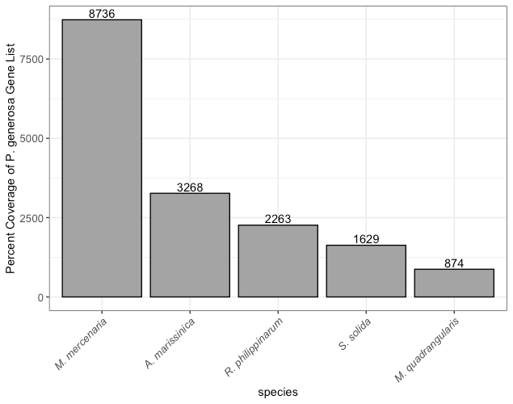

::: {.callout-warning}
## Status

This report is a Roberts Lab working manuscript. It has not been peer reviewed.

It is shared to make small scientific efforts, preliminary analyses, technical observations, and exploratory work openly available.

This report corresponds to Chapter 2 of Olivia Cattau's M.S. thesis, *Developing Tools and Resources for Maturation Control in Bivalvia* (University of Washington, 2023).
:::

## Abstract

Pacific geoduck (*Panopea generosa*) is a subtidal clam species with a range from Alaska to Baja California. In this study, five transcriptomic libraries from three tissue types (gonad, heart, ctenidia) and two different life stages (larvae, juvenile) were assembled and annotated with biological ontological information. A particular emphasis in this study were reproductive genes and the gonad library, as the most likely location for reproductive candidate genes for gene editing. In addition, a comparative genomic approach was used to look for homologous genes across the Venerida clade. This effort represents an establishment of an important genomic resource for Pacific geoduck that will be valuable in the improvement of sustainable aquaculture.

## Background

Farming of geoduck clams, *Panopea generosa*, in the cold, nutrient-rich, and clean waters of the Pacific Northwest is a long-standing tradition and important cultural, economic, and ecological part of the coastal communities [@feldman2004comprehensive]. Geoduck clams live deep in the intertidal zone (-2.0 feet and below) but have been observed as deep as 360 feet [@wdfw2023geoduck]. Geoduck clams are large, long-lived, and fecund. They are reproductive as males as early as 2 years old and are often considered market size at 5 years old. In the wild, geoducks are found between 18-80 feet deep and take 15 years to reach full maturation (~7 lbs.). The oldest recorded living geoduck was 173 years old and can be sexually mature up to 50 years [@edge2021multicentennial]. Due to their long lives and sexual asynchronicity, they have a low effective population size [@vadopalas2015maturation].

Geoduck clams are an increasingly important fishery and aquaculture product for the Eastern Pacific coast of the US from Baja California to Alaska. The geoduck industry consists of a small number of private operators committed to harvesting, processing, and marketing their product. Geoduck meat is sold primarily outside of the US; siphon meat goes to Japan and Taiwan while body meat is sold in California and the East Coast [@cheney1986shellfish]. Geoduck aquaculture is considered the most economically important clam fishery in North America [@hoffman2000modeling], bringing in $24.5 million in sales and over $1 million in state revenue in 2013 [@washingtonseagrant2015shellfish]. Geoduck aquaculture also supports local oyster farming due to its high price per square acre. Recent evidence also suggests that geoduck aquaculture gear can support the recovery of the threatened cockle species in Washington State [@dimond2022population].

Geoducks are primary consumers of phytoplankton by filter feeding. As filter feeders, geoducks provide essential ecosystem services by removing algae, organic matter, and excess nutrients from the water column [@cubillo2018ecosystem]. In addition, when geoducks are harvested, excess nutrients such as nitrogen and phosphorus are removed from the marine ecosystem. Geoducks are a keystone species in the subtidal zones, removing organic matter from the environment and providing a food source for the declining populations of sea otters and crabs.

Wild populations have been threatened by overharvesting and poaching [@kuow2015poaching]. Due to concerns of genetic mixing between hatchery and wild populations, most aquaculture of geoduck is done using wild broodstock, but the potential for genetic mixing still exists. Farmed geoducks may become reproductively mature as early as two years old [@vadopalas2015maturation]. Due to these concerns, a key area of research focuses on the reproductive biology of geoduck clams. The use of triploid geoduck clams may help alleviate reproductive maturation in farmed clams, akin to research done on ploidy in Pacific oysters [@allen1986performance]. Due to issues with triploidy, there is a need to better understand the reproductive genes responsible for sexual maturation to provide resources for future work developing sterility approaches. This work could include the development of gene knock-down strategies.

The main objective of this study is to build annotated reference transcriptome libraries. There were three specialized tissue types: gonad, ctenidia, and heart. There were two tissue samples from pooled larvae and pooled juveniles as well. In addition, this study also leveraged tools and resources from previously published genome and transcriptome studies on clams from Venerida.

The publication of a fully annotated juvenile *P. generosa* reference genome [@putnam2022dynamic], along with previous studies focusing on geoduck genomics and gene expression in response to environmental stress, contributes to a comprehensive understanding of geoduck and mollusk genomics while shedding light on the role of DNA methylation in environmental acclimatization. Previous work on geoduck genomics focuses on gene expression in response to environmental stress. Work on the *P. globosa* juvenile transcriptome exposed to chronic and acute thermal stress demonstrated similar gene expression patterns between stressed and non-stressed animals [@juarez2018transcriptomic]. In the same study there was also a high degree of expression of genes related to DNA repair and transcription regulation in chronically exposed juveniles, where protective genes against oxidative stress were highly expressed in acutely exposed juveniles. @timminsschiffman2017integrating published the first proteomic study of three maturation stages in male and female geoduck clams using gonad proteins. They showed that gonad proteins became increasingly divergent between males and females as maturation progressed. @venkataraman2019larval investigated sex-specific broodstock response and differential gene expression in *P. generosa* in response to low pH. Temperature and dissolved oxygen increases corresponded to differences in protein abundance patterns such as heat shock protein 90-α. In larvae, @timminsschiffman2020dynamic looked at the proteomics of larval *P. generosa* with ciliate infection to investigate the molecular underpinnings of the innate immune response of the larvae to a pathogen. Ciliate response proteins included many associated with ribosomal synthesis and protein translation, suggesting the importance of protein synthesis during larval immune response. In juvenile *P. generosa*, @gurr2020metabolic and @gurr2022acclimatory conditioned the animals before testing them with elevated pCO2 (~2400 μatm). Following the secondary exposure, neither elevated nor ambient pCO2 altered juvenile respiration rates, indicating ability for metabolic recovery under subsequent conditions. Recently, @putnam2022dynamic published an annotated *P. generosa* reference genome as part of a larger common-garden ocean acidification study. They looked at the role of DNA methylation on environmental acclimatization. Functional enrichment analysis of differentially methylated genes revealed regulation of signal transduction that influences cell growth, proliferation, tissue and skeletal formation, and cytoskeletal change. This work, as well as the present study, will greatly aid in the collective understanding of not only geoduck genomics but overall mollusk genomics. In this study, five RNA-seq transcriptome libraries from three geoduck tissue types (gonad, heart, ctenidia) and two different life stages (larvae, juvenile) were assembled and annotated with biological Gene Ontology information. A particular emphasis in this study were reproductive genes and the gonad library, as the most likely location for reproductive genes.

In addition to the five geoduck RNA-seq libraries described in this study, there is also value in leveraging publicly available data for a comparative clam species transcriptome study. @mun2017whole published a transcriptome of the Manila clam (*Ruditapes philippinarum*) as part of a greater effort in selective breeding and disease control. They reported 41,275 annotated sequences in the de novo whole transcriptome assembly of *R. philippinarum* across three different tissues (foot, gill, and adductor muscle). @wang2016clam was the first to publish an annotated transcriptome of the hard clam *Mercenaria mercenaria*, as part of work investigating the parasite QPX in hard clams. A de novo assembly was constructed and a consensus transcriptome of 62,980 sequences were functionally annotated. A total of 3,131 transcripts were identified as differentially expressed in healthy versus infected tissues. Comparative analysis of annotated genes can reveal the conserved molecular mechanisms between mollusks, such as genes with high homology expressed across the Venerida clade.

Genome resources for clams in the Venerida clade are more abundant than transcriptome or proteomic resources. A reference genome is available in *R. philippinarum* [@mun2017whole] and *M. mercenaria* [@wang2016clam] as part of the research mentioned above. To leverage even more clam genomic resources, the genomes of *Spisula solida*, *Mactra quadrangularis*, and *Archivesica marissinica* were also compared to *P. generosa* for functional analysis. The assembly of the surf clam, *S. solida*, was based on Hi-C data generated as part of the Darwin Tree of Life Project. The other surf clam, *Mactra quadrangularis* (or *Mactra veneriformis*), also has a recently assembled genome [@sun2022high]. Low natural yields in *M. quadrangularis* in China led to this recent effort to better understand surf clam genomic resources. Using Hi-C assembly, a total of 29,315 protein-coding genes were predicted. From this study, a genome-level phylogenetic tree was constructed demonstrating that *M. quadrangularis* and *R. philippinarum* diverged around 231 million years ago. In the Northern quahog clam, *Mercenaria mercenaria*, @farhat2022comparative published the first publicly available genome. Due to high environmental variability on the East Coast of the US, and a desire to understand mass mortality events, the genome of *M. mercenaria* needed to be assembled. Genome annotation yielded 34,728 predicted protein-coding genes, the most of all the Venerida so far. Using these previously published genomic resources by running a comparative genomic analysis will provide an important resource for future comparative work.

Limited studies in bivalve genomics have investigated sexual maturation through differential gene expression in various tissue types. @dheilly2012gametogenesis looked at the basis of sex differentiation in Pacific oysters (*Crassostrea gigas*) using a microarray assay. Gene expression was studied in the gonad over a yearly reproductive cycle. There were 2,482 genes found to be differentially expressed between males and females during gametogenesis. The expression of 434 genes could be localized to the germ cells or somatic cells of the gonad and between the sexes. Maturation analysis processes like this study can reveal the conserved and diverged genes between male and female gonads.

Transcriptomics is an important field of study that provides insight into the complex gene expression patterns of various organisms. Comparative transcriptomics allows for a deeper understanding of the differences and similarities in gene expression between different species. In addition to a functional annotation of the geoduck transcriptome, the focus of this study will be to investigate and characterize five different geoduck tissue types (gonad, heart, ctenidia, larvae, and juvenile). We compared the transcriptomes of Manila clams (*R. philippinarum*), Mercenaria clams (*M. mercenaria*), and Pacific oysters (*Crassostrea gigas*) against the geoduck (*P. generosa*) transcriptome, focusing on the most commonly expressed and overexpressed Gene Ontology (GO) terms and genes. Genomes of five clam species were also compared to the *P. generosa* genome, looking for genes with high homology. As more clam species are sequenced and genomes assembled, the overall gap in knowledge will decrease and more functional applications for aquaculture can be developed.

## Methods

There is a reference genome of juvenile *P. generosa* recently published by @putnam2022dynamic. They used the Proximo Hi-C process (Phase Genomics) resulting in 18 chromosome scaffolds containing 1.42 Gbp of sequence (64.53% of the corrected assembly). Juicebox correction resulted in a scaffold N50 of 57,743,597 bp. Genome annotation identified 34,947 genes and 236,960 coding sequence regions which corresponds to 38,326 mRNA features. Genome feature tracks included genes, exons, introns, repetitive sequences, and CG motifs [@roberts2018opportunities]. Annotation yielded 16,899 tRNAs with a mean and median length of 75 bp in the range of 53-314 bp. CG content was determined to be 33.78% and a total of 15,712,294 CG motifs are present in the genome. The assembled genome is available on the National Center for Biotechnology Information website (NCBI) under GCA_902825435.1. Sequences were annotated by comparing contiguous sequences to the UniProtKB/Swiss-Prot database (<http://uniprot.org>) using the BLASTn algorithm [@altschul1997gapped] with a 1.0E-20 e-value threshold. Based on the Swiss-Prot values, there were 14,672 protein-coding sequences in the *P. generosa* genome that had gene ontology characterization information such as GO enrichment analysis.

Total RNA was extracted from adult, juvenile, and pooled larvae of *P. generosa*. The adult tissue was isolated using the PAXgene Tissue RNA Kit (Qiagen) based on manufacturer's instructions. The adult tissue was separated into three different types by function: gonad, ctenidia, and heart. Five RNA-seq libraries were constructed from pooled mRNA and sequenced at the University of Washington High Throughput Genomics Unit (HTGU) on the Illumina Hi-Seq 2000 platform (Illumina, San Diego, CA, USA). Each library was run on a single lane. Raw sequence reads were quality trimmed using Trim Galore v0.4.0, and the sequence data was quality assessed using FastQC [@andrews2010fastqc].

Sequences were annotated by comparing contiguous sequences to the UniProtKB/Swiss-Prot database (<http://uniprot.org>) using the BLASTn algorithm with a 1.0E-20 e-value threshold. Genes were then classified according to their biological processes, determined by their Gene Ontology (GO) information, and classified into one or more of 72 parent categories (GO slims). The full dataset is available in Supplementary Table 2. Genes were classified into their RNA-seq library (ctenidia, gonad, heart, juvenile, or larvae) and any gene with a transcript per million (tpm) greater than zero was retained for analysis. Gene Ontology terms were then characterized relative to all Gene Ontology terms (GO slims) present in the *P. generosa* genome. A new term was calculated by taking the proportion of a single GO slim present in an RNA-seq library over the proportion of that same GO slim present in the entire *P. generosa* gene set. We coined this new term the "Gene Ontology Proportional Value", where, for example, when the proportional value equals one, the GO slim in the RNA-seq library is representative of the GO slim in the entire gene repertoire.

*M. mercenaria* and *R. philippinarum* transcriptomes were annotated by comparing sequences to the entire gene list of *P. generosa* and given Gene Ontology Proportional Values for inter-species comparison. Transcriptome libraries were obtained from NCBI (*R. philippinarum* GenBank accession GCA_026571515.1 and *M. mercenaria* accession GCF_021730395.1). Gene lists were annotated using BLASTn with an e-value of 1E-20 and associated Gene Ontology terms classified and counted by transcriptome library (either *M. mercenaria* or *R. philippinarum*). Gene Ontology terms were then classified using the same process as the geoduck sequence analysis above. The Gene Ontology Proportional Value was calculated using the proportion of GO slims present in either *M. mercenaria* or *R. philippinarum* transcriptome libraries relative to the proportion of that same GO slim present in the entire *P. generosa* transcriptome library.

In order to see if there was a functional difference between genes with high homology, five different clam genomes in the Venerida family were annotated: *Archivesica marissinica* (GenBank GCA_014843695.1), *Mactra quadrangularis* (GCA_025267735.1), *Mercenaria mercenaria* (GCF_021730395.1), *Ruditapes philippinarum* (GCA_026571515.1), and *Spisula solida* (GCA_947247005.1). All five clam genomes were annotated by comparing contiguous sequences to the *P. generosa* gene database using the BLASTn algorithm with a 1.0E-20 e-value threshold.

Characterization of reproductive genes in *P. generosa* was done in two ways. The first was to gather a list of genes expressed in the gonad. This produced a list of reproductive genes in the *P. generosa* adult gonad that code for proteins related to "reproductive process" functions (Supplementary Table 3).

@dheilly2012gametogenesis investigated the temporal variation of gene expression during oyster gonad differentiation and development in *C. gigas*. The genes identified in their oyster study are differentiated by sex and stage of development: somatic tissues and oocytes. Differentially expressed oyster gonad and oocyte genes were pulled from their Supplementary Table 3. GenBank accession numbers were gathered from clusters 1-10 and were annotated against the *P. generosa* gene database using the BLASTn algorithm with a 1.0E-10 e-value threshold. The focus of this analysis was the female reproductive genes from developmental stage 0 to stage 3, compared to the reproductive genes found in the RNA-seq gonad library.

## Results

After leveraging the genomic resources from @putnam2022dynamic to compare to the Swiss-Prot database, a fully annotated genome-linked transcriptome was produced. This genome has 34,947 annotated protein-coding sequences. Of those, 2,180 are expressed only in the juveniles. The RNA-seq library for larval geoduck returned 19,449 genes with 868 genes found only in the larval transcriptome library. In the heart library, there were 17,479 genes representing only 371 genes unique to the heart. In the ctenidia, there were 17,479 genes representing 340 genes found only in the ctenidia tissue library. Most crucially for this study on reproduction, the gonad RNA-seq library had the fewest genes, with only 13,682. Of those genes, 119 were found uniquely expressed in the gonad. The full annotation of the five RNA-seq libraries is found in Supplementary Table 2. A pairwise comparison between RNA-seq libraries was produced from the unique gene list above, represented as a count of biological gene ontology terms (Supplementary Figure 2).

Expanding out from gene characterization, the Gene Ontology Proportional Value is descriptive of the abundance of biological Gene Ontology processes per library relative to the entire *P. generosa* genome (@fig-go-proportion). In the *P. generosa* genome, there are 17,611 GO slims representing 34,947 genes. In the juvenile, there are 17,277 GO slims representing 19,449 genes. In the larvae, there are 16,632 GO slims representing 19,449 genes. In the heart there are 16,021 GO slims representing 17,602 genes. In the ctenidia, there are 15,911 GO slims representing 17,479 genes. Finally, in the gonad there are 14,715 GO slims representing 13,682 genes.

{#fig-go-proportion}

Annotations from the *M. mercenaria* and *R. philippinarum* transcript libraries against the *P. generosa* gene list revealed a strong phylogenetic correlation between *P. generosa* and *M. mercenaria*. Of the 34,947 mRNA features in the *P. generosa* transcriptome, 5,099 (14.6%) were found in the *M. mercenaria* transcriptome. In contrast, only 657 (1.8%) mRNA features were found in the *R. philippinarum* transcriptome. The transcript libraries of *M. mercenaria* and *R. philippinarum* were annotated with Gene Ontology Proportional Values. In *M. mercenaria* transcript libraries there are 7,027 GO slims, while in *R. philippinarum* there are only 1,390 GO slims. The most abundant GO slim categories were anatomical structure development, signaling, and cell differentiation. For example, of the 456 genes shared between *P. generosa* and *M. mercenaria*, the most abundant were related to anatomical structure development, while only 67 genes related to anatomical structure development were shared between *P. generosa* and *R. philippinarum*.

Annotations from other clam genomes against the *P. generosa* genome further highlighted genomic homology (@tbl-genome-comparison). The *M. mercenaria* genome is 1.9 Gb and the CG content was determined to be 34.5%. Of the 34,947 genes in *P. generosa*, 8,736 genes were matched in *M. mercenaria*, the most matches of all five genomes. The *R. philippinarum* genome is 1.4 Gb and the CG content was determined to be 32%; 2,263 genes found in *P. generosa* were matched in *R. philippinarum*. The *A. marissinica* genome is 1.5 Gb and the CG content was determined to be 39%; of those genes in *P. generosa*, 3,268 were matched to *A. marissinica*. *S. solida* is a smaller genome at 932 Mb, with a CG content of 35.5%, and 1,629 genes matched to the *P. generosa* genome. The *M. quadrangularis* annotated genome is the smallest of the five with a size of only 979 Mb, a CG content of 33%, and only 874 gene matches to the *P. generosa* gene set.

| Species | Genome size | CG content | Genes matched to *P. generosa* |
|---|---|---|---|
| *Mercenaria mercenaria* | 1.9 Gb | 34.5% | 8,736 |
| *Archivesica marissinica* | 1.5 Gb | 39% | 3,268 |
| *Ruditapes philippinarum* | 1.4 Gb | 32% | 2,263 |
| *Spisula solida* | 932 Mb | 35.5% | 1,629 |
| *Mactra quadrangularis* | 979 Mb | 33% | 874 |

: Genome size, CG content, and number of genes matched to the *P. generosa* gene set for five Venerida clam genomes. {#tbl-genome-comparison}

{#fig-genome-coverage}

Characterization of reproductive genes in *P. generosa* was done in two ways. The first was to gather a list of genes expressed in the gonad. This produced a list of reproductive genes in the *P. generosa* adult gonad coding for proteins related to "reproductive process" functions (Supplementary Table 3). Of the 34,947 genes in the *P. generosa* gene list, 640 genes are involved with the reproductive process (1.8% reproductive).

Leveraging @dheilly2012gametogenesis results from 32 individual gonad samples of *C. gigas*, they identified 2,482 genes differentially expressed between gametogenesis stages. Of those, 511 genes were found to be expressed in major expression stage 0 of development (neither male nor female). Of those 511 oyster reproductive genes, 7 geoduck reproductive genes were found in the *P. generosa* genome. Key genes from stage 0 are *Ttn*, *BMP2*, and *ZNF107*. In the next developmental stage, major expression stages 1-3 for females, there were 197 genes differentially expressed in oysters. Of those 197 genes, 5 candidate genes were found in *P. generosa*. The only candidate gene from stages 1-3 is *Rusf1*. In the later developmental stages 2-3, @dheilly2012gametogenesis found 312 candidate reproductive genes, and of those 312, we found 13 candidate genes. Key candidate genes from this developmental stage are *SMC5*, *Cep57*, *KCTD5*, *ATF7IP*, and *TPST1*. In the final developmental stage 3, @dheilly2012gametogenesis reported 222 reproductive genes. Our annotation revealed 14 *P. generosa* reproductive genes including *STOX1*, *SPPL3*, *Wdr20*, and *Rere*. There were also two *P. generosa* genes found in cluster 9 (female and male differentially expressed gametogenesis stages) that were specific to the female gonad tissue. Those genes were *SUMO3* and *ARHGAP11A*.

## Discussion

The generation of five fully characterized RNA-seq libraries provides comprehensive insights into gene expression patterns, ultimately advancing our understanding of Pacific geoduck reproductive biology and gene expression profiles. These transcript libraries are beneficial to describing individual tissue functions, as the unique sets of genes found in each tissue type are consistent with their specialized functions. For example, the heart tissue had a unique set of genes involved in muscle and renal system processes, which are important for its role in circulation [@drake2012amino]. The ctenidia tissue had a unique set of genes involved in DNA repair, which is likely important for its role in filtering and cleaning the water that the geoduck lives in [@juarez2018transcriptomic]. The larval library had a unique set of genes involved in nucleobase-containing small molecule metabolic processes and cytoskeleton organization. The juvenile library was the largest, with 67.01% of genes expressed relative to the entire gene list of geoduck, representing almost all of the relevant biological processes.

We found that each tissue type exhibited a distinct set of expressed genes, indicating unique functional roles. These genes are categorized into their biological gene ontology (GO) processes by their Gene Ontology Proportional Value into over-abundant or under-abundant relative to the entire *P. generosa* genome. The most commonly over-abundant GO processes distinct to all tissue types were related to metabolism, gene expression, and protein making (@fig-go-proportion), indicating that metabolism is more important at the specialized tissue level for geoduck. The most common under-abundant GO processes were related to specialized system processes such as renal, endocrine, digestive, and circulatory systems. This is unsurprising, as digestive biological processes are going to be under-expressed in tissue types that don't specialize in digestion. Most of the over-abundant GO processes unique to specific tissue types were functional to their specific needs. For example, in the gonad, the top over-abundant GO processes were related to mitochondria and metabolism, while in the larvae the top over-abundant GO processes were related to movement and energy allocation systems. For the heart, the top over-abundant GO processes were related to nitrogen cycle metabolism, agreeing with its main function as a mechanical pump as well as its electrical activity [@drake2012amino]. For the ctenidia, the top over-abundant GO processes were related to cytoplasmic translation. Cytoplasmic translation refers to the process by which mRNA molecules are translated into proteins in the cytoplasm of the cell. This process is important in many cells, including those in the ctenidia, because it allows for rapid and efficient protein synthesis [@mclean1974rna]. The juvenile tissue types did not have any highly over-abundant genes due to their later developmental stage.

Investigating the annotated transcriptome libraries shared between *P. generosa* and *M. mercenaria* or *R. philippinarum* further illuminates foundational gene expression of *P. generosa*. Genes involved with translation, microtubule-based movement, and cilium organization are all highly expressed in both the *M. mercenaria* and the *R. philippinarum* libraries. Interestingly, there is a unique group of conserved genes in *M. mercenaria* and *P. generosa* that are not found in *R. philippinarum*. These genes were related to metabolism and cellular organization. These differences, as well as *M. mercenaria* having more shared genes than *R. philippinarum*, may be due to *M. mercenaria* being a closer phylogenetic relation to *P. generosa* than *R. philippinarum* [@chen2011molecular]. The inter-species analysis is valuable in determining gene orthologs important for reproduction investigations. Cross-species library comparison is also useful for future studies on gene function in marine bivalves outside of reproductive control, such as studies involving disease tolerance.

In the *P. generosa* genome from @putnam2022dynamic, they found the geoduck genome to be almost 2 times larger in size than oyster genomes, with twice as many putative chromosomes. This trend reversed when comparing *P. generosa* to other clam genomes. *R. philippinarum*, *M. mercenaria*, and *A. marissinica* all have genomes larger than *P. generosa* and an additional chromosome. Interestingly, regardless of genome size, the relative number of genes was approximately the same (~30,000). The GC content was also highly conserved across species at 32-33% (except for *A. marissinica* at 39%). Comparing the percent coverage of the *P. generosa* gene list to the query sequences of the other five clam genomes, *A. marissinica*, *R. philippinarum*, and *S. solida* have shared gene lists with *P. generosa* of 3,268, 2,263, and 1,629 respectively. *M. mercenaria* has the most shared genes with *P. generosa* at 8,736, and *M. quadrangularis* the least with only 874 (@fig-genome-coverage). Looking at the phylogenetic relationship between *M. mercenaria* and *R. philippinarum* [@chen2011molecular] reveals that *R. philippinarum* is more basal than *M. mercenaria*. As more genomes are fully annotated and made available on NCBI, comparative studies like this will be more robust.

A key emphasis of this study was to describe reproductive genes in geoduck. Our first approach, using the gonad RNA-seq library, produced a moderately large set of genes (n = 640) with gene expression patterns related to the reproductive process. This is consistent with previous studies [@timminsschiffman2017integrating] that have shown reproductive tissues often have unique gene expression profiles. Leveraging the results of @dheilly2012gametogenesis provided a list of reproductive genes found in geoducks (74) that are linked to a major expression stage by sex and developmental stage. Looking at highly conserved reproductive genes across species gives us confidence that these are homologous genes for controlling reproduction in Bivalvia. @dheilly2012gametogenesis described reproductive genes related to mitosis and meiosis regulation, including centromere proteins and kinesin-related proteins. In the *P. generosa* transcriptional dataset, reproductive genes related to centromere and kinesin-related proteins were: Kinesin-like protein 6, KIF18A, and KIF9, inner centromere protein, centromere protein zw10 homolog, and centromere-associated proteins S, E, and X. @dheilly2012gametogenesis identified genes associated with female-specific processes such as oogenesis, including vitellogenin, cd63, mitotic apparatus, p62, forkhead box L2, and caveolin. In *P. generosa*, reproductive genes related to oogenesis were: putative vitellogenin receptor (protein yolkless), forkhead box protein C1 and J3, and RecQ-mediated genome instability protein 1 (M-caveolin).

Between the two approaches for identifying key reproductive genes in *P. generosa*, there are two genes found using both: *Foxl1* and *Cep57*. The *Fox* genes, which code for forkhead-class transcription factors, are classical orthologs involved in sex determination/differentiation [@broquard2021gonadal]. @dheilly2012gametogenesis found forkhead box L2 genes in *C. gigas*. Many studies on bivalves have found this gene to be involved in reproduction, having been found in *C. gigas* and the pearl oyster *Pinctada fucata*, as well as other bivalves [@matsumoto2013reproduction]. The *Cep57* gene, which codes for centrosome- and midbody-associated proteins, is not commonly studied for its implications in reproduction in bivalves. A similar ortholog, *Cep55*, has been documented to be involved in embryonic development in zebrafish [@jeffery2015cep55], and should be the focus of study in bivalve reproduction going forward. In particular, genes related to vitellogenin, caveolin, forkhead-class transcription factors, and Cep55/57 all appear to be highly conserved across Bivalvia and are very closely related to reproductive development.

Our results provide a foundation for future studies aimed at understanding the molecular basis of geoduck (*Panopea generosa*) physiology and development. Comparative analysis with Mercenaria clam and Manila clam transcript libraries provided insights into gene orthologs and conserved functions across species. Annotated RNA-seq libraries facilitated the identification of tissue-specific genes, including a significant number of previously undiscovered reproductive genes in geoduck. Specifically, forkhead and Cep55/57 genes are key genes found. Each tissue type exhibited distinct sets of expressed genes, reflecting their specialized functions. Over-abundant biological gene ontology (GO) terms in all tissue types were related to metabolism, gene expression, and protein synthesis, highlighting the importance of these processes at the tissue level. The study also focused on identifying reproductive genes for potential gene editing efforts, highlighting key genes involved in sex determination, oogenesis, and embryonic development. Overall, these findings lay the groundwork for future studies investigating geoduck physiology, development, and reproductive control, as well as broader investigations into gene function and disease tolerance in marine bivalves. By identifying these tissue-specific gene expression patterns, we can begin to unravel the complex molecular networks that underlie geoduck biology.

## Data and code availability

The juvenile *P. generosa* reference genome is available on NCBI under accession GCA_902825435.1. Comparative genomes and transcriptomes were obtained from NCBI: *Ruditapes philippinarum* (GCA_026571515.1), *Mercenaria mercenaria* (GCF_021730395.1), *Archivesica marissinica* (GCA_014843695.1), *Mactra quadrangularis* (GCA_025267735.1), and *Spisula solida* (GCA_947247005.1). Supplementary tables and figures referenced here are part of the original thesis.

## Suggested citation

Cattau, O., and S. B. Roberts. 2023. *Comparative Genomic Analysis of Geoduck Clam (Panopea generosa)*. Current Findings. Available at: https://robertslab.github.io/current-findings/reports/geoduck-comparative-genomics/

## Version history

| Version | Date | Notes |
|---|---|---|
| 0.1 | 2026-06-17 | Migrated from Cattau_washington_0250O_25940.pdf (M.S. thesis Chapter 2) |

## References

::: {#refs}
:::
