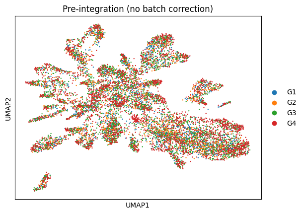
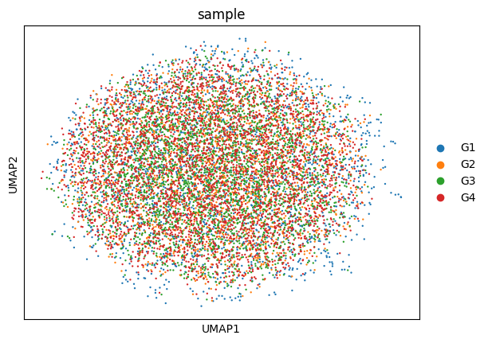
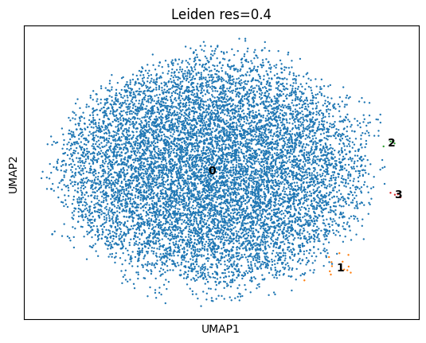
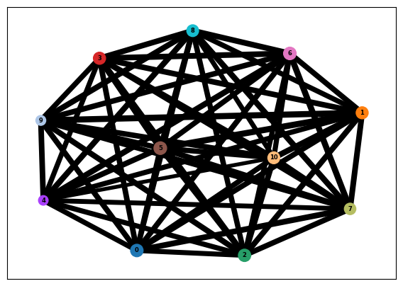
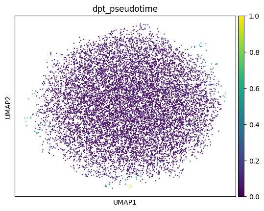
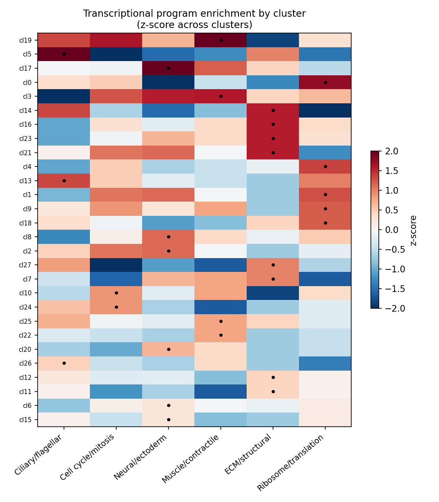
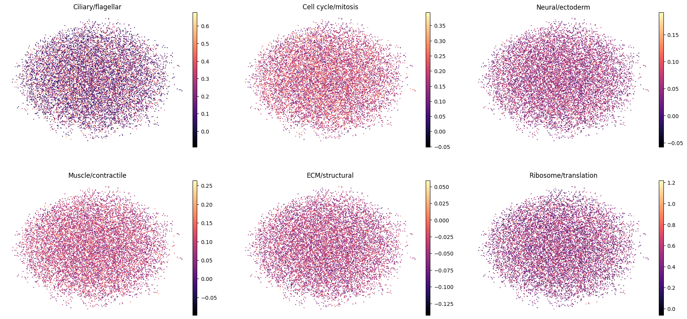

::: {.callout-warning}
## Status

This report is a Roberts Lab working manuscript. It has not been peer reviewed.

It is shared to make small scientific efforts, preliminary analyses, technical
observations, and exploratory work openly available.

:::

## Background and Summary

The Pacific geoduck (*Panopea generosa*) is a long-lived, economically important
burrowing clam and a growing focus of aquaculture in the Pacific Northwest. Despite
a published genome assembly and annotation, no single-cell transcriptomic data have
been available for the species, leaving the cellular composition of its development
uncharacterized.

Here we describe a single-cell RNA-sequencing (scRNA-seq) dataset of geoduck
gastrula-stage embryos: four separate 10x Genomics libraries (biological replicates
of a single developmental stage), processed with Cell Ranger against the *P.
generosa* genome. After uniform quality control and batch integration, the dataset
comprises **10,481 high-quality cells** profiled across a shared 34,947-gene
reference.

The cells form a **continuous transcriptional landscape** rather than discrete,
well-separated cell-type clusters, and no single-stage developmental trajectory is
recoverable — the expected signature of a gastrula in which lineage specification is
underway but incomplete. Importantly, the continuum is not featureless: once genes
are functionally annotated, clusters along it show clear, biologically coherent
enrichment for the major embryonic lineage programs — **ciliary/flagellar,
neural/ectoderm, muscle/contractile, extracellular-matrix (ECM)/structural,
cell-cycle, and biosynthetic (ribosomal)**. Individual cells co-express these
programs (graded, not committed), while the cluster-level program structure is
strong and interpretable.

To our knowledge this is the first single-cell transcriptomic reference for geoduck.
We release it as a resource — raw matrices, an integrated and annotated `AnnData`
object, candidate cell-state marker tables, and interactive Loupe browser files — to
support comparative molluscan development and aquaculture genomics. The principal
limitations (modest sequencing depth and a single stage) are stated openly and
motivate the candidate, signature-based framing of the cell states.

## Methods

### Sample design and sequencing

Four libraries (G1–G4) were prepared from dissociated cells of geoduck
gastrula-stage embryos as **biological replicates of a single stage** (not a
developmental time series). Libraries were sequenced and processed with 10x Genomics
Cell Ranger `count` [@zheng201710x] against the *P. generosa* genome
(`Geoduck_mkref_genome` reference; 34,947 gene models, `PGEN_*` identifiers) with
`--include-introns` to capture pre-mRNA reads, appropriate for a non-model
invertebrate with a sparse annotation.

Sequencing depth differed substantially between replicates: G3 and G4 received
roughly 2–3× the reads of G1 and G2 (Number of Reads 43.4–135.5 M; mean reads/cell
15,332–39,226), which is accounted for in QC below.

### Quality control and integration

Filtered feature–barcode matrices from all four samples were merged into a single
object with sample-prefixed barcodes. To remove a depth-driven low-count tail
present only in the shallower samples (G1/G2), **uniform** thresholds were applied
across all replicates: ≥250 genes/cell, ≥500 UMI/cell, and genes detected in ≥3
cells. This retained 10,481 of 12,305 cells (85.2%) and 19,324 genes; removed cells
came almost entirely from G1 (31%) and G2 (33%), equalizing the per-replicate
quality floor.

Counts were normalized (counts-per-10,000, log1p), and 2,000 batch-aware
highly-variable genes were selected. After scaling and PCA (50 components), replicate
batch effects were removed with **Harmony** [@korsunsky2019harmony] over the sample
variable. Because G1–G4 are biological replicates, integrating over sample is the
appropriate choice. A neighbor graph and UMAP were computed on the Harmony-corrected
space, and **Leiden** clustering [@traag2019louvain] was run across resolutions
0.1–1.0. Analyses used Scanpy [@wolf2018scanpy].

### Trajectory analysis

Developmental-continuum structure was tested with PAGA [@wolf2019paga] and diffusion
pseudotime on the integrated object (after removing 23 G1-specific outlier cells).

### Functional and cell-state annotation

`PGEN` gene identifiers were joined to the *P. generosa* gene-annotation mapping
table (UniProt accession, gene symbol, description, GO IDs;
`20220419-pgen-gene-accessions-gene_id-gene_name-gene_description-alt_gene_description-go_ids.tab`).
Per-cluster markers were computed with a Wilcoxon rank-sum test and annotated with
this table. Six curated lineage-program gene sets (ciliary/flagellar, cell
cycle/mitosis, neural/ectoderm, muscle/contractile, ECM/structural,
ribosome/translation; 207–526 genes each) were assembled from gene
descriptions/symbols/GO terms and scored per cell with `scanpy.tl.score_genes`.
Program scores were averaged per cluster and z-scored across clusters.

## Data Records {#sec-data-records}

The release comprises processed single-cell objects, annotation tables, and
figures. Counts in `.X` are raw integers; a log-normalized matrix is stored in
`.raw`, and raw counts are also retained in `.layers['counts']`.

| File | Contents |
|---|---|
| `geoduck_merged_filtered.h5ad` | Raw merged matrix, 12,305 cells × 34,947 genes, sample labels |
| `geoduck_integrated.h5ad` | QC'd (10,481 cells), Harmony-integrated; `leiden_*` res 0.1–1.0; functional annotation in `.var`; program scores and `top_program` in `.obs` |
| `geoduck_trajectory.h5ad` | 10,458 cells (G1 outliers removed); PAGA, diffusion pseudotime, diffmap |
| `cluster_markers_annotated.csv` | Top-15 markers per cluster with symbol, description, log-fold-change, adjusted p-value |
| `program_scores_by_cluster.csv` | Mean lineage-program score per cluster |
| Per-sample Cell Ranger `outs/` | Filtered/raw matrices, BAMs, `metrics_summary.csv`, `web_summary.html`, `cloupe.cloupe` |

## Technical Validation

### Library quality and consistency

All four libraries align to the same reference and share nearly identical
top-expressed genes, indicating consistent chemistry with no per-sample technical
artifact dominating. The most abundant gene accounts for only ~0.75% of UMIs in
every sample (no rRNA/mitochondrial contamination). Mapping rates were modest across
samples (~42% confidently to genome, ~23% to transcriptome) — typical for a
non-model invertebrate with an imperfect annotation.

| Sample | Cells | Median UMI/cell | Median genes/cell | Total reads | Genes detected |
|--------|------:|----------------:|------------------:|------------:|---------------:|
| G1 | 2,912 | 724 | 551 | 48.1 M | 18,050 |
| G2 | 2,832 | 714 | 547 | 43.4 M | 17,738 |
| G3 | 3,107 | 1,467 | 953 | 103.1 M | 20,063 |
| G4 | 3,454 | 1,649 | 1,038 | 135.5 M | 21,004 |

### Integration removes the depth confound

Before integration, replicate centroids showed an ordered drift in PCA space
(G1≈G2 → G3 → G4) tracking the G1/G2-versus-G3/G4 sequencing-depth difference. Since
the libraries are replicates, this is a nuisance rather than biology; Harmony removed
it, and the integrated UMAP shows the four replicates thoroughly intermixed
(@fig-integration).

::: {layout-ncol=2}
{#fig-preint}

{#fig-integration}
:::

### A continuous landscape, not discrete cell types

Leiden clustering across resolutions does not yield robustly separable clusters:
below resolution 0.4 all cells collapse to a single cluster, and at resolution ≥0.6
the silhouette score on the integrated space is negative — clusters partition a
continuum rather than separating discrete islands. At resolution 0.4 the dominant
cluster holds 10,458 of 10,481 cells (99.8%); the only structure that splits off is
three tiny G1-specific outlier specks (4, 5, and 14 cells), which were removed from
downstream analysis (@fig-res04).

{#fig-res04}

### No single-stage trajectory

PAGA and diffusion pseudotime independently indicate no trajectory: the diffusion
spectrum is flat (no spectral gap after the trivial first eigenvalue), the PAGA graph
is a fully-connected mesh (all 55 cluster pairs strongly connected; median
connectivity 0.74), and pseudotime shows no gradient and is flat across replicates
(@fig-paga, @fig-pseudotime). This is expected: trajectory inference requires cells
spanning developmental time, which a single stage does not provide.

::: {layout-ncol=2}
{#fig-paga}

{#fig-pseudotime}
:::

### Nascent lineage programs along the continuum

Functional annotation covered **11,549 of 19,324 expressed genes (59.8%)**.
Top cluster markers include recognizable, conserved cell-state genes — ciliary/IFT
genes (`cfap36`, `Ift88`, `KIF3A`, axonemal dynein assembly factors), neural/ectoderm
transcription factors (`sox3`, `TFAP2A`), and cell-cycle genes (`cyclin-B`, `Cdt1`,
`Aurka`, `ttk`).

Scoring the six curated lineage programs shows that **clusters are strongly
distinguished by program** (per-program enrichment spread 3.4–4.9 z-units across
clusters; @fig-heatmap), even though the programs are spatially diffuse on the UMAP
(@fig-progscores). Per-cell specialization is weak (median top1–top2 program-score
margin = 0.58 z), i.e. individual cells co-express multiple programs.

| Program | Genes | Strongly enriched clusters |
|---|--:|---|
| Ciliary/flagellar | 526 | 5, 13, 26 |
| Cell cycle/mitosis | 494 | 10, 24 |
| Neural/ectoderm | 429 | 2, 8, 17, 20 |
| Muscle/contractile | 254 | 3, 19, 22, 25 |
| ECM/structural | 270 | 11, 12, 14, 16, 21, 23 |
| Ribosome/translation | 207 | 0, 1, 4, 9, 18 |

{#fig-heatmap}

{#fig-progscores}

Together these results indicate that the major embryonic lineage programs are already
detectable and cluster-organized at the gastrula stage, but not yet resolved into
discrete, committed cell-type territories — the expected hallmark of mid-gastrulation.

## Usage Notes

Program- and cluster-level assignments are **candidate, signature-based** identities
and warrant orthogonal validation (e.g. whole-mount HCR/in situ hybridization of
representative ciliary, neural, and muscle markers). Two characteristics should guide
reuse: (i) the dataset is a single developmental stage, so it cannot support
developmental-trajectory reconstruction on its own; and (ii) sequencing depth is
modest (median ~550–1,650 UMI/cell), which limits resolution of fine sub-states.
Deeper sequencing and additional stages would address these directly. The annotated
`geoduck_integrated.h5ad` is the recommended entry point; the Loupe (`cloupe.cloupe`)
files allow interactive browsing without a Python/R environment.

## Suggested citation

Roberts, S. B. 2026. *A Single-Cell Transcriptomic Reference of the Geoduck
(Panopea generosa) Gastrula*. Current Findings. Available at:
https://robertslab.github.io/current-findings/reports/geoduck-gastrula-scrnaseq/

## Version history

| Version | Date | Notes |
|---|---|---|
| 0.1 | 2026-06-17 | Drafted from REPORT.md analysis report |
