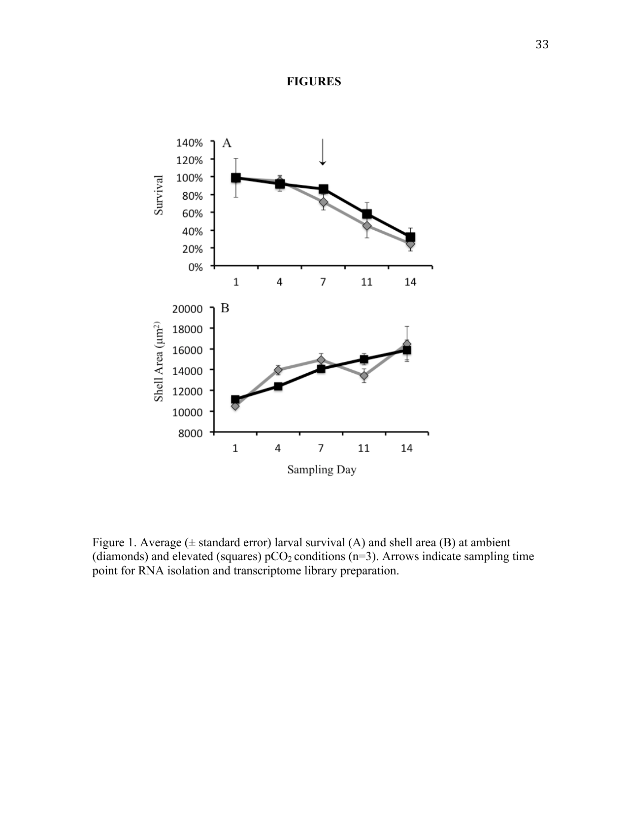
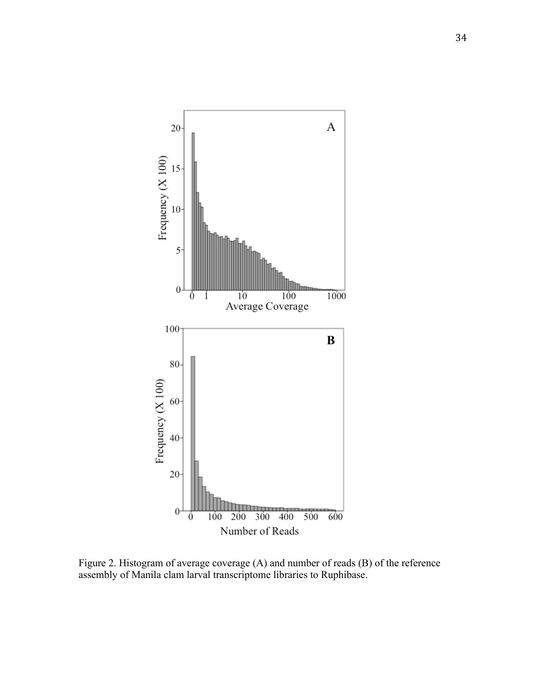
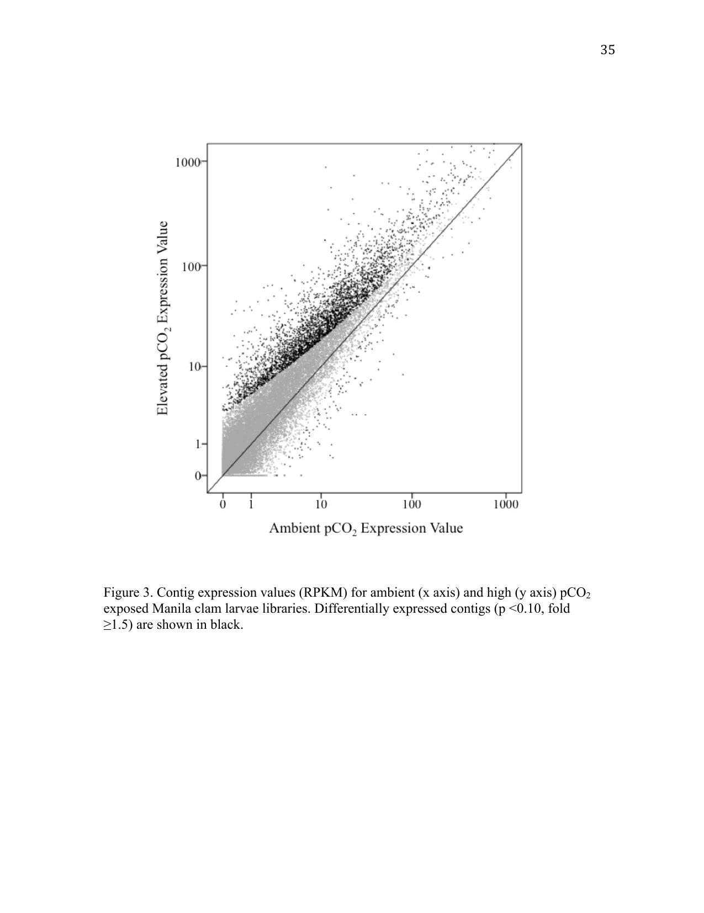

::: {.callout-warning}
## Status

This report is a Roberts Lab working manuscript. It has not been peer reviewed.

It is shared to make small scientific efforts, preliminary analyses, technical
observations, and exploratory work openly available.
:::

This report is derived from Chapter I of David C. Metzger's University of
Washington Master of Science thesis (2012), *Characterizing the effects of ocean
acidification in larval and juvenile Manila clam, Ruditapes philippinarum, using
a transcriptomic approach*.

## Background

The Manila clam (*Ruditapes philippinarum*) is an ecologically and commercially
important bivalve mollusc found along the west coast of North America, Europe,
and throughout Asia. Adult Manila clams are infaunal and produce planktonic
larvae that remain in the water column for about two weeks. The larval period is
considered a particularly vulnerable life stage given the small size, lack of a
robust shell, and degree of morphological and physiological changes experienced
during this period. Changes in environmental conditions that negatively impact
larval survival could have ecosystem-wide consequences and disrupt aquaculture
production. Studies on Manila clam larvae have documented sensitivity to several
stressors including temperature, salinity, pathogens, and food availability
[@numaguchi1998preliminary; @paillard2004short; @inoue2007effect; @yan2009effects],
however there are no studies investigating the impact of ocean acidification.

Ocean acidification refers to the reduced pH in oceans as a result of increased
anthropogenic CO~2~ emissions [@caldeira2003anthropogenic; @feely2004impact; @sabine2004ocean].
Increasing partial pressure of CO~2~ (pCO~2~) in seawater alters the carbonate
chemistry, effectively reducing the saturation state of biologically important
carbonate compounds such as aragonite and calcite [@feely2004impact]. Coastal
waters are of particular concern as other natural and anthropogenic processes can
exacerbate these changes in water chemistry [@feely2008evidence; @feely2010combined].
Environmental conditions associated with ocean acidification could be devastating
to local organisms, particularly marine calcifiers that use carbonate minerals to
form shells [@caldeira2003anthropogenic]. Knowledge of the physiological
mechanisms underlying species response to elevated pCO~2~ conditions will provide
a better understanding of the organismal and ecological impacts of ocean
acidification [@portner2008ecosystem; @widdicombe2008predicting].

The use of transcriptomic approaches can provide valuable information on the
organismal response to changing environmental conditions. Previous studies have
investigated the impact of ocean acidification on gene expression, many focusing
on sea urchins, which have significant genomic resources. One technique is to
select a set of target genes and perform quantitative PCR analysis. This method
has been used in sea urchins to characterize a suite of genes involved in stress
response, biomineralization and metabolism [@odonnell2009predicted; @stumpp2011co2; @martin2011early].
@todgham2009transcriptomic and @odonnell2010ocean used a more global approach,
examining 1,057 sea urchin genes on a microarray platform and providing insight
into the transcriptomic response of critical processes including acid-base
balance and biomineralization. Most recently, @moya2012whole utilized Illumina
RNA sequencing and RNA-Seq [@wang2009rnaseq] to characterize the transcriptome of
the coral *Acropora millepora*. Consistent with the earlier microarray studies
[@todgham2009transcriptomic; @odonnell2010ocean], the authors noted that a
majority of transcripts were decreased in corals exposed to elevated CO~2~, but
also a more variable response of taxon-specific genes involved in
biomineralization and skeletal organic matrix [@moya2012whole].

Advancements in high-throughput sequencing and bioinformatic analysis have allowed
for the transcriptomic characterization of organisms with limited genomic
information. Examples include differentially expressed genes in Pacific oyster
populations [@gavery2012characterizing], transcripts involved in shell deposition
in arctic clam [@clark2010insights], and biological processes associated with
thermal stress and development in coral [@meyer2011profiling]. A value in this
approach is that there are no *a priori* assumptions concerning the physiological
response to a particular treatment or condition. This is particularly advantageous
in characterizing the effects of ocean acidification, as studies in other taxa
have shown a reallocation of resources that might not be readily evident. For
example, in brittle stars increased calcification in response to elevated pCO~2~
resulted in a decrease in muscle mass [@wood2008ocean], while in mussels a
decrease in calcification was associated with an increase in energy demand
required for maintaining pH homeostasis [@thomsen2010moderate].

In this study, growth, mortality, and the underlying transcriptomic response of
larval Manila clams are characterized under elevated pCO~2~ conditions.
Characterization of the underlying processes affected by elevated pCO~2~ will
provide valuable information toward elucidating the physiological response of
Manila clam larvae to ocean acidification, and insight for future research
investigating exposure of bivalves to elevated pCO~2~ conditions.

## Methods

### Recirculating seawater system

This experiment was conducted at the NOAA Northwest Fisheries Science Center in
Seattle, Washington, in a laboratory designed to study the impacts of ocean
acidification on marine resources. Seawater for the experiment was collected from
Elliott Bay near Seattle and filtered to 2 µm, degassed using Liqui-Cel membrane
contactors (Membrana, Weppertal, Germany) under partial vacuum, and added to
individual recirculating seawater systems. Each system contained a gas exchange
reservoir (492 L) in which ambient or elevated pCO~2~ conditions were created by
bubbling CO~2~, air, or CO~2~-free air in seawater, with gas additions controlled
by a program built in LabView software (National Instruments, Austin, TX). This
program adjusted gas additions to maintain a treatment pH that equates to the
target pCO~2~, given seawater temperature (18 °C), salinity (29.4 psu), and
alkalinity (2069 µmol/kg). Water chemistry in each system was continuously
monitored using a Durafet pH electrode, dissolved oxygen transmitter, and
conductivity and temperature probes (Honeywell Process Solutions, Bracknell,
Berkshire, UK) in a reservoir separate from the gas exchange reservoir.
Gas-equilibrated seawater flowed into six replicate, 4.5 L, CO~2~-impermeable
larval chambers per treatment with an average flow rate of 3 L/hour. Water was
delivered through the base of each chamber and exited through a port in the lid
covered by a 50 µm bag filter to retain larvae. Effluent from the chambers and
water bath was pumped through a 2 µm filter, UV treatment, and heat pump before
returning to the gas exchange reservoir. Water from each treatment system was
continuously exchanged with the laboratory's main reservoir (103% of each
treatment exchanged/day), so that no treatments were isolated.

### Experimental design

One system maintained near present-day (ambient) oceanic sea-surface levels of
pCO~2~ (355 ± 16.85 µatm pCO~2~; pH 8.07 ± 0.02) and the second system maintained
an elevated pCO~2~ concentration (897.74 ± 47.61 µatm pCO~2~; pH 7.71 ± 0.02),
resulting in a difference of 0.36 pH units, a change expected to occur by the year
2100 [@caldeira2005ocean]. Spectrophotometric pH was measured on each sampling day
in larval chambers within each system and was also used to confirm Durafet pH
probe readings. Water samples for total alkalinity and dissolved inorganic carbon
were taken on days 3, 5, and 12 and analyzed at the NOAA Pacific Marine
Environmental Laboratory (PMEL). All samples were analyzed according to Department
of Energy guidelines [@doe1994handbook]. A summary of carbonate chemistry
parameters monitored during this experiment is provided in @tbl-chem.

Manila clam larvae (5 days old) were wrapped in moist cheesecloth and shipped
overnight from Taylor Shellfish in Kona, Hawaii. Larvae were distributed in twelve
4.5 L chambers containing ambient pCO~2~ seawater to a density of approximately
11 larvae/mL (48,600 larvae/chamber). Larval chambers were placed in the
appropriate recirculating seawater treatment system (6 chambers/treatment) where
seawater containing either 400 µatm (ambient) or 900 µatm (elevated) pCO~2~ was
distributed to each chamber. Larval clams were fed a mixture of algae
(*Nannochloris* sp., *Chaetoceros muelleri*, *Isochrysis galbana*, and *Pavlova
lutherii*) twice daily at a final concentration of 50,000–80,000 cells/mL.
Chambers were cleaned on a semi-weekly schedule that coincided with sampling.

### Larval mortality and size analysis

Three larval chambers from each treatment were sampled for mortality and size
analysis on days 1, 4, 7, 11, and 14 of the study. To minimize potential impacts
of reduced larval densities, consecutive sampling of chambers between sampling
days was avoided. Sampling consisted of concentrating all larvae from a chamber on
a 50 µm screen and adding 50 mL of the appropriate seawater. Two replicate samples
of ~50 larvae each were then transferred into 12-well plates for subsequent
mortality counts and size analysis. Larval mortality was determined by counting
the number of dead larvae using an inverted compound microscope at 20× magnification
(Nikon). Ethanol (75%) was then added to immobilize live larvae in order to count
the total number of larvae per well. Larval size was determined by analyzing
photographs taken at 5× magnification. Total surface area for each larva was
calculated using ImageJ [@rasband1997imagej; @abramoff2004imagej]. Data collected
from replicate samples within a chamber were averaged. T-tests were conducted to
compare mean larval sizes between treatments on each sampling day, with statistical
significance based on Bonferroni-corrected alpha values (< 0.01). Differences in
survival were assessed by generating the slope of the regressions based on larval
abundance in each individual larval chamber, and a generalized linear model was
then applied to calculated slope values on each sampling day. All statistical
analyses were conducted using SPSS statistical software (IBM, Somers, NY).

### Larval RNA isolation

Samples for RNA isolation were taken on day 7 by straining larval chambers onto a
50 µm screen to remove seawater. Samples were snap frozen in liquid nitrogen and
stored at −80 °C. Two chambers from each treatment were harvested in this manner
for a total of four samples consisting of ~30,000 larvae each. RNA was isolated
using Tri-reagent (Molecular Research Center, Inc.) following manufacturer
protocols. Equal quantities of total RNA (20 µg) from the replicate samples for
each treatment were pooled and used for the construction of two transcriptome
libraries.

### High-throughput sequencing

Library construction and sequencing were performed at the University of Washington
High Throughput Genomics Unit on the Illumina HiSeq platform (Illumina Inc., San
Diego, CA) using standard protocols as outlined by the TruSeq RNA Sample
Preparation Guide (part #15001836 Rev A) and the HiSeq 2000 User Guide (part
#15011190 Rev. K). CLC Genomics Workbench version 4.0 (CLC bio) was used for all
sequence analysis. Initially, sequences were trimmed based on a quality score of
0.05 (Phred; @ewing1998basecalling2; @ewing1998basecalling1) and the number of
ambiguous nucleotides (> 2 on ends). Sequences smaller than 25 bp were also removed.

### Reference assembly

For the reference assembly, RuphiBase, a transcriptome database for *R.
philippinarum* (http://compgen.bio.unipd.it/ruphibase/), was used as the reference
transcriptome. At the time of analysis this database consisted of 32,606
contiguous sequences (contigs) generated from 454 (Roche) reads
[@milan2011transcriptome], 5,656 Sanger Expressed Sequence Tags (ESTs), and 51
publicly available mRNA sequences. Contigs in RuphiBase are annotated by Gene
Ontology (GO) and protein (NCBI nr database) BLAST results. Sequences from the
ambient and elevated pCO~2~ library treatments were combined and mapped to the
RuphiBase transcriptome database using the following parameters: ungapped
alignment, mismatch cost = 2, limit = 8.

### RNA-Seq analysis

RNA-Seq analysis was carried out to determine differential gene expression
patterns between the two libraries, using the following parameters: unspecific
match limit = 10, maximum number of mismatches = 2, minimum number of reads = 10.
Expression values were measured in RPKM (reads per kilobase of exon model per
million mapped reads; @mortazavi2008mapping). Differentially expressed genes were
identified as having > 1.5-fold difference between libraries and a p-value < 0.10
[@baggerly2003differential]. Hypergeometric tests on annotations were performed to
identify enriched biological processes. This test procedure was performed using
CLC Genomics Workbench v4.0 and is similar to the unconditional GOstats test of
@falcon2007using. Significantly enriched (p < 0.10) GO terms and associated
p-values were visualized using REViGO (Reduce + Visualize Gene Ontology)
[@supek2011revigo].

## Results

### Larval growth and survival

Survival and growth of *R. philippinarum* were similar at both pCO~2~ treatments
(p > 0.05) (@fig-growth). Larval shell size increased at similar rates in both
treatments over the course of the experiment, and no difference was detected in
larval size between pCO~2~ treatments. Larval survival decreased at similar rates
between pCO~2~ treatments and no difference in survival was detected.

{#fig-growth}

### Characterization of short read sequences

A total of 244,082,559 reads were generated with an average length of 36 bases.
After quality trimming, 99.7% of the reads were retained. All data are available
in the NCBI Short Read Archive database (Sample ID: SRS283130). Reference assembly
of reads from the Illumina HiSeq libraries mapped to 84% of the contigs in
RuphiBase. Average coverage for the assembly was 17× with an average number of
reads of 133 (@fig-coverage).

{#fig-coverage}

### RNA-Seq analysis

RNA-Seq using RuphiBase as the scaffold identified 3,954 differentially expressed
contigs. Of those, 162 contigs were expressed at a lower level in larvae exposed
to elevated pCO~2~ conditions, and 3,792 were expressed at an elevated level
(@fig-expression). Among differentially expressed contigs, 204 were expressed over
10-fold higher in elevated pCO~2~ conditions, including the calcification gene
perlucin 6, which was expressed 133-fold higher under elevated pCO~2~ conditions.
Only 8 contigs were expressed 10-fold lower under elevated pCO~2~ conditions. A
complete list of all differentially expressed genes is provided in Supplemental
Table 1.

{#fig-expression}

### Gene enrichment analysis

Differentially expressed contigs that were annotated in RuphiBase (n = 781) were
subjected to enrichment analysis to identify enriched biological processes.
Hypergeometric tests revealed 55 biological processes significantly enriched in
the differentially expressed gene set. The most enriched processes were associated
with translation, followed by development, hydrogen peroxide catabolism, ATP
synthesis-coupled proton transport, and the respiratory electron transport chain
(@fig-go). Contigs corresponding with enriched biological processes are denoted
(*) in Supplemental Table 1.

{#fig-go}

## Discussion

Growth and survival of *R. philippinarum* larvae were similar between the pCO~2~
treatments. These results are consistent with a recent study in juvenile
*Ruditapes decussatus* for which no difference in growth or mortality was observed
in elevated pCO~2~ environments [@range2011calcification]. In contrast, a majority
of studies in larval bivalves have demonstrated that ocean acidification
negatively affects survival, growth, and physiology
[@michaelidis2005effects; @orr2005anthropogenic; @gazeau2007impact; @talmage2009effects; @mcdonald2009effects; @miller2009shellfish].
Larval tolerance to increased pCO~2~ is likely taxa- and age-dependent. This study
was designed to assess the physiological response of Manila clam larvae with fully
calcified shells to an acute change in carbonate chemistry. Analysis of parameters
such as fertilization rates, or the response of trochophore and early veliger
stage clam larvae, could reveal an impact of altered pCO~2~ conditions. Similar
growth patterns under the two pCO~2~ conditions suggest that transient exposure of
mid-stage veliger larvae to acidified water would not significantly impact Manila
clam larval survival.

Elevated pCO~2~ significantly altered gene expression patterns in Manila clam
larvae, as revealed by RNA-Seq analysis. Increased global gene expression
(@fig-expression), as well as the enrichment of genes associated with translational
activity (@fig-go; Supplemental Table 1), are consistent with an increase in the
protein synthesis necessary to maintain homeostasis in an elevated pCO~2~
environment. Increased expression could also be a response to repairing or
replenishing damaged protein products. Regardless of the primary reason for the
upregulation of this suite of genes, protein synthesis is an energetically
demanding process that could impair other critical physiological processes by
limiting available energy resources. It is possible that the effects of the
physiological stress induced by elevated pCO~2~ might become apparent only in a
later stage of development. Thus, any species fitness predictions based solely on
the absence of an impact on larval growth and survival should be regarded with
caution.

Another group of differentially expressed genes identified are associated with
ATP-coupled proton transport (@fig-go). ATP-coupled proton transport is an integral
part of the electron transport chain and the generation of ATP [@senior2002molecular].
These genes are also involved in several other vital biological processes including
the maintenance of hemolymph pH [@byrne1997ion] and regulation of ion concentrations
involved in calcification [@liang2007cloning; @mcconnaughey2008carbon]. Maintenance
of hemolymph pH would be required under decreased seawater pH conditions, as
bivalves possess an open circulatory system. In fact, it has been suggested that
the ability to control extracellular acid-base balance can determine species
tolerance to elevated pCO~2~ levels [@widdicombe2008predicting]. ATP-coupled proton
transport genes are also involved in regulating ion transport, including Ca^2+^.
Increased expression of these genes could be indicative of an organism increasing
scavenging efforts as a result of reduced calcium carbonate ions. By increasing
scavenging efforts, Manila clams could increase their tolerance for lower
concentrations of calcium carbonate, as they would be more adept at obtaining these
molecules at lower concentrations.

Similarly, other proteins such as calmodulin are involved in scavenging and
detecting Ca^2+^ ions. Calmodulin is known to be involved in Ca^2+^ metabolism and
calcification in bivalves [@li2005cdna]. Calmodulin, and a regulator of calmodulin,
G protein beta-subunit, were expressed at a higher level in larvae exposed to
elevated pCO~2~ concentrations (Supplemental Table 1). In addition, expression of
perlucin 6, a gene involved in nucleation of calcium carbonate ions during shell
formation [@blank2003nacre; @hofmann2008using], was 133-fold higher in larvae
exposed to elevated pCO~2~. Coordinated expression of these calcium-associated
genes may be essential for larval tolerance of elevated pCO~2~ conditions.

Regulation of protein synthesis occurs on multiple levels including gene
expression, translation, and post-translational modifications, and it should be
noted that changes in transcription do not necessarily correlate to changes in the
corresponding protein concentration or activity [@feder2005biological; @tomanek2011environmental].
In fact, it is likely that responses to ocean acidification are regulated at
multiple levels. For instance, a study in larval barnacles found that elevated
pCO~2~ induced changes in protein concentrations and post-translational
modifications [@wong2011response]. Thus, an integrated approach to evaluate
physiological responses at both the transcriptional and translational level will
improve our understanding of how species will respond to environmental
perturbation.

In summary, this study illustrates that transcriptomic characterization provides
important insight into organismal processes affected by elevated pCO~2~ conditions
that are not necessarily apparent with standard morphometric and survival analysis.
Furthermore, these data indicate that increased translational activity and specific
processes associated with ion transport could contribute to short-term resilience
in clams. Further research is needed to determine how these transcriptomic changes
and elevated pCO~2~ will impact Manila clams at different developmental stages, and
whether acute exposures to elevated pCO~2~ have a long-term influence on survival.

## Water chemistry

| Treatment | pCO~2~ (µatm) | pH |
|---|---|---|
| Ambient | 355 ± 16.85 | 8.07 ± 0.02 |
| Elevated | 897.74 ± 47.61 | 7.71 ± 0.02 |

: Summary of larval Manila clam seawater chemistry during the exposure. {#tbl-chem}

## Suggested citation

Metzger, D. C., and S. B. Roberts. 2012. *Impact of elevated pCO2 conditions on
larval Manila clam physiology revealed by RNA sequence analysis*. Current
Findings. Available at:
https://robertslab.github.io/current-findings/reports/manila-clam-larvae-pco2-rnaseq/

## Version history

| Version | Date | Notes |
|---|---|---|
| 0.1 | 2026-06-17 | Migrated from Metzger_washington_0250O_10509.pdf (Chapter I) |
