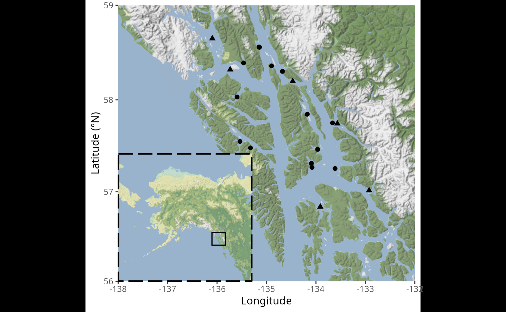

::: {.callout-warning}
## Status

This report is a Roberts Lab working manuscript. It has not been peer reviewed.

It is shared to make small scientific efforts, preliminary analyses, technical observations, and exploratory work openly available.
:::

::: {.callout-note}
## About this report

This report corresponds to Chapter 2 of Aspen Coyle's University of Washington Master of Science thesis, *Causes of Infection and Disease Progression of Hematodinium sp. in the Tanner crab, Chionoecetes bairdi* (2024). It has been adapted into a standalone Current Findings report.
:::

## Background

Tanner crab (*Chionoecetes bairdi*) is a marine decapod common to the waters of the North Pacific from Oregon to the Bering Sea [@jadamec1999biological]. They are abundant along the continental shelf of much of Alaska, and support a valuable commercial fishery [@punt2015effects]. They are also closely related to the snow crab (*C. opilio*), and commonly produce fertile hybrids where their ranges overlap [@urban2002testing]. The Bering Sea *C. opilio* fishery has historically been one of the most lucrative fisheries in the United States [@divine2019new], but recently experienced a dramatic and unexpected population crash [@szuwalski2023collapse].

Both *C. bairdi* and *C. opilio* are infected by *Hematodinium* sp., a parasitic dinoflagellate that, along with other members of its genus, infect over 50 crustacean species around the globe. *Hematodinium* sp. multiplies within the hemolymph and tissues of its hosts, depleting the number of circulating hemocytes and damaging numerous vital organs such as the heart, gills, and hepatopancreas. As the parasite continues to multiply, the host experiences respiratory dysfunction and severe tissue damage, causing lethargy and then death [@wheeler2007pathology]. Transmission is assumed to be waterborne and to occur directly between hosts, as heavily-infected hosts release large numbers of dinospores into the water column [@li2021parasitic]. However, the dynamics of transmission are still poorly understood and have proved difficult to unravel. Though the relationship between infection and temperature is uncertain, infection rates in boreal hosts tend to peak in summer [@li2021parasitic], indicating a potential link to climate change.

*Hematodinium* sp. was first observed in the North Pacific in 1985 — though it may have been present long before — when the southeastern Alaska *C. bairdi* fishery noticed some crabs had a distinctly bitter flavor, along with milky hemolymph and an unusually pink, opaque carapace [@meyers1987bitter]. This combination of symptoms, which came to be called Bitter Crab Syndrome (BCS), was found to be characteristic of late-stage infections. While low-level *Hematodinium* sp. infections cannot be diagnosed without microscopy or genetic sequencing, visual observation can detect BCS with relatively high accuracy [@jadamec1999biological]. Subsequent research then uncovered a link between BCS and shell condition. Since *C. bairdi* undergoes a terminal molt, terminally-molted crabs see a general deterioration of their shells over time due to natural wear and tear (Tamone et al. 2007). Shell condition is thus used as a proxy for age, as well as time since terminal molt. Crabs with older shells are substantially less likely to display symptoms of BCS, indicating individuals are more prone to infection during or soon after molt (Eaton et al. 1991).

Since its initial observation in 1985, *Hematodinium* sp. has become one of the most common parasites of *C. bairdi* in southeastern Alaska. The region is marked by numerous fjords and bays. This complicates the disease dynamics substantially, with spatially close areas often having different infection rates. Over an eight-year study, nearly 70% of *C. bairdi* assessed in the Port Frederick area were positive for BCS, while at Icy Bay — under 30 miles away — only 4% were positive [@bednarski2011overview]. Given *C. bairdi* is in a state of panmixia throughout its range [@johnson2019genetic], infection rates are uncorrelated with host density, and the pattern is still observed even when only examining mature males [@bednarski2011overview], these consistent differences in infection rates are unlikely to be caused by differences in hosts. Instead, environmental and parasite-specific variables are likely responsible.

Previous research on factors correlated with *Hematodinium* spp. infection rates have found a number of intriguing associations. Several hosts have displayed seasonal cycles of infection rates, though with substantial variance in peak timing (Eaton et al. 1991; [@davies2019spatial; @smith2015parasitization]). In some hosts, molting has also been linked to infection rates, perhaps due to the soft, permeable cuticle of freshly-molted crabs rendering them vulnerable to infection [@shields2005epidemiology], which, since smaller individuals molt more frequently, can result in higher infection rates at smaller sizes [@lycett2018relationship]. Several hosts have also demonstrated higher infection rates in females than in males [@stentiford2001relationship; @lycett2018relationship]. In *Chionoecetes*, the relationship of sex and size to infection remains unclear, with studies finding conflicting results (Eaton et al. 1991; [@pestal2003monitoring; @shields2005epidemiology]).

As *C. bairdi* supports a valuable commercial fishery and *Hematodinium* sp. infections are thought to be fatal [@shields2005epidemiology], it is important to understand what renders individuals vulnerable to infection. With that aim, we used a multidecadal dataset, collected using consistent methodology, to uncover physiological and environmental variables correlated with *Hematodinium* sp. infection.

## Methods

### Survey Design

Annual pot surveys were conducted by the Alaska Department of Fish and Game (ADF&G) from 2005 to 2019. Two surveys were conducted each year. The red king crab survey (RKC survey) was carried out from June to August and was focused on the red king crab (*Paralithodes camtschaticus*) stock, though large numbers of *C. bairdi* were caught as well. The *C. bairdi* survey was carried out from September to October, and was focused on the *C. bairdi* stock.

Both surveys were conducted in numerous survey areas within Southeast Alaska (@fig-survey). With the exception of Holkham Bay and Juneau, there was no overlap in survey areas between the *C. bairdi* survey and the RKC survey.

Each survey area was divided into density strata using a Neyman allocation based on the variance of crab density estimates over a three-year period (Rebert et al. 2019; Stratman et al. 2019). The number of pots for the survey area, determined based on logistical feasibility, were then divided among density strata. Precise pot locations were randomly assigned within each stratum using Geospatial Modeling Environment [@beyer2004hawths] with a minimum distance of 0.1 nautical miles between pots. If a pot location was not possible due to gear conflicts or other issues, a preselected pot location was used. Pots were set from 12:00 to 18:00 and pulled from 07:00 to 13:00. Soak times ranged from 18 to 20 hours for the RKC survey and 16 to 20 hours for the *C. bairdi* survey. The survey used conical top-loading commercial crab pots with an 88-inch diameter and no escape rings. Frozen herring or a mix of frozen herring and pink salmon was used as bait. A temperature logger was attached to each pot, with temperature readings taken at one-hour intervals for all surveys except the 2005 *C. bairdi* survey, which had temperature readings taken every 3 hours and 30 minutes.

For each *C. bairdi* captured, sex and shell condition were determined and the specimen was measured for carapace width (CW) using standard ADF&G codes and protocols [@jadamec1999biological]. The presence of Bitter Crab Syndrome (BCS) and infection with black mat fungus (*Trichomaris invadens*), along with the presence of other pathogens, was noted when present, as were any missing legs or carapace damage. Female crabs were classified for maturity and measured for clutch fullness. If present, the condition of any eggs was noted. A subset of male crabs were measured for right chela height, as the ratio of carapace width to chela height indicates crab maturity.

{#fig-survey}

### Data Analysis and Modeling

Temperature data were obtained by cross-referencing pot set and pot retrieval times with data from the temperature loggers. Temperature for the pot deployment was determined by excluding readings taken within one hour of pot setting or retrieval to account for discrepancies in timekeeping, and then averaging the remaining readings. Pot deployments with a temperature variance of over 3°C were discarded, as this indicates the pot was likely not deployed for part of the timeframe. All deployments with an average temperature over 9°C were manually checked by cross-referencing the logger data files with NOAA sea surface temperature for that day and area [@noaa1971meteorological], as well as an examination of the trends in the logger data files. Apparent data entry errors were discarded. Temperature readings were then averaged for all pots at the site for that year, producing the temperatures generally experienced by the crab in its environment.

Apparent data entry errors, incomplete entries, and irrelevant variables were eliminated, leaving a total of 151,313 measurements. To identify factors affecting BCS prevalence, generalized linear mixed models (GLMMs) were fitted using the R package glmmTMB [@brooks2017glmmtmb]. Predictors of BCS prevalence were shell condition (light, new, old, very old), temperature (°C), carapace width (mm), injuries (present/absent), sex (male/female), latitude, presence of Black Mat, and depth (meters). Year and site were used as random effects, as baseline rates of infection differ consistently between sites and across years. Continuous predictors were scaled, and categorical predictors were converted to factors. Shell condition was specified to be an ordered factor. Julian day was not used, as it covaried with temperature.

As *C. bairdi* displays pronounced sexual dimorphism, with males being much larger than females [@jadamec1999biological], carapace width was scaled separately for males and females. Collinearity of predictors was assessed using VIFs, with no variables having high collinearity (>5). Models were examined to check model assumptions, overdispersion, and goodness of fit. Models were weighted based on AICc, and a weighted average was taken of all models with a weight of 0.01 or greater.

$$
\begin{aligned}
\text{Infection}_{i,j,k} &\sim \text{Binomial}(\mu_{i,j,k}) \\
E(\text{Infection}_{i,j,k}) &= \mu_{i,j,k} \\
\log\left(\frac{\mu_{i,j,k}}{1-\mu_{i,j,k}}\right) &= \text{ShellCondition}_{i,j,k} + \text{Temperature}_{i,j} + \text{CarapaceWidth}_{i,j,k} + \text{BlackMat}_{i,j,k} \\
&\quad + \text{Sex}_{i,j,k} + \text{Latitude}_{i,j,k} + \text{Depth}_{i,j,k} + \text{Year}_i + \text{Site}_j \\
\text{Year}_i &\sim N(0, \sigma^2) \\
\text{Site}_j &\sim N(0, \sigma^2)
\end{aligned}
$$

**Equation 1.** The full model, in which $\text{Infection}_{i,j,k}$ is the $k$th crab in year $i$ at site $j$; $\text{Year}_i$ and $\text{Site}_j$ are the random effects, which are assumed to be normally distributed with mean 0 and variance $\sigma^2$.

To determine whether certain measured sex-specific factors were associated with infection, two more models were created following the same protocol and incorporating sex-specific measurements.

$$
\begin{aligned}
\log\left(\frac{\mu_{i,j,k}}{1-\mu_{i,j,k}}\right) &= \text{ShellCondition}_{i,j,k} + \text{Temperature}_{i,j} + \text{CarapaceWidth}_{i,j,k} + \text{BlackMat}_{i,j,k} \\
&\quad + \text{Latitude}_{i,j,k} + \text{Depth}_{i,j,k} + \text{ClutchFullness}_{i,j,k} + \text{EggDev}_{i,j,k} + \text{Year}_i + \text{Site}_j
\end{aligned}
$$

**Equation 2.** The female-specific model modified the full model by incorporating clutch fullness (percent) and the amount of egg development (juvenile, barren, uneyed, eyed) as predictors, while dropping sex as a predictor since only female measurements were used. A total of 24,726 measurements were used for the female-specific model.

$$
\begin{aligned}
\log\left(\frac{\mu_{i,j,k}}{1-\mu_{i,j,k}}\right) &= \text{ShellCondition}_{i,j,k} + \text{Temperature}_{i,j} + \text{CarapaceWidth}_{i,j,k} + \text{BlackMat}_{i,j,k} \\
&\quad + \text{Maturity}_{i,j,k} + \text{Latitude}_{i,j,k} + \text{Depth}_{i,j,k} + \text{Year}_i + \text{Site}_j
\end{aligned}
$$

**Equation 3.** The male-specific model took the full model and added maturity status (immature/mature) as calculated by the ratio of chela height to carapace width (Tamone et al. 2007), while dropping sex as only males were examined. A total of 23,461 measurements were used for this model.

## Results

### General Model

Of the 8 predictor variables examined, 6 were significant (p < 0.05) (@fig-general-coef). New-shell crabs were more likely than old-shell crabs to show signs of BCS (p < 0.0001). Carapace width was positively associated with infection (p < 0.0001), while depth was negatively correlated (p < 0.0001). Female crabs were more prone to infection than were males (p < 0.0001). Crabs infected with *T. invadens* were less likely to display signs of BCS (p < 0.0001), though with a relatively high standard error (0.18) as only 4% of individuals were infected by *T. invadens*. There was a weak relationship to temperature, with warmer sites showing higher rates of infection (p = 0.012). No relationship was observed with leg condition (p = 0.32) or latitude (p = 0.71).

{#fig-general-coef}

{#fig-general-rel}

### Female-Specific Model

Generally, variables examined in the female-specific model (@fig-sex-coef) displayed the same relationships as those in the general model. The exceptions are temperature (p = 0.25) and infection with *T. invadens* (p = 0.18), neither of which was significant in this model. Of the new sex-specific predictors, immature females had higher rates of infection than mature females (p = 0.028), while females with a higher clutch fullness had lower rates of infection (p < 0.0001). The raw data, however, appears to reveal a normal distribution, with highest infection rates at medium clutch fullness (@fig-sex-rel B). However, it appears that this is due to the rarity of infected crabs with high clutch fullness (@fig-sex-rel C).

### Male-Specific Model

The predictors in the male-specific model (@fig-sex-coef) generally followed the same patterns of significance as the general model, though, as with the female-specific model, both temperature (p = 0.41) and infection with *T. invadens* (p = 0.97) were not significant in this model. Additionally, though not significant in the general model, the presence of injuries was positively correlated with infection status in the male-specific model (p = 0.0009). Maturity status was significant (p < 0.0001), with higher infection rates among immature males than among mature males (@fig-sex-rel D).

{#fig-sex-coef}

![Relationships present in the raw data between BCS status and the significant sex-specific predictors in the female-specific model (A–C) and male-specific model (D). When present, error bars represent standard error. Only categories with over 50 measurements are graphed. Panel B shows the infection rates at each level of clutch fullness, while panel C shows overlapping histograms of clutch fullness for both BCS-positive and negative crabs. Y-axes are not held constant between figures, with the exception of A and B.](figures/fig11-sexspecific-relationships.png){#fig-sex-rel}

## Discussion

We found that infection status was related to a number of biological variables, namely carapace width, sex, maturity status, clutch status (for females), and time since molt. Depth was the only environmental variable with a consistent relationship to infection status.

Within all models, the coefficient with the highest absolute value was, by a substantial portion, shell condition. This finding agrees with existing research, as numerous studies have found that recently-molted *C. bairdi* are more prone to infection by *Hematodinium* sp., potentially due to the soft, permeable nature of the shell shortly after molting (Eaton et al. 1991; Imamura & Woodby 1994). Crabs with a shell condition of "Light", which corresponds to 2–8 weeks post-molt [@jadamec1999biological] are less likely than new-shell crabs, but more likely than old-shell crabs, to display signs of BCS (@fig-general-coef, @fig-general-rel A). From this, it is apparent that the minimum time between infection and visible symptoms of BCS is, for some individuals, less than eight weeks.

The second-highest absolute value within the full model was sex (0.250). Interestingly, when examining the raw data, males were more likely to be infected than females (@fig-general-rel C), while the model found that females were more likely to be infected than males (@fig-general-coef). Previous research on this subject has been contradictory. Within a population of the closely-related *C. opilio* in the Canadian Maritimes, females were more likely than males to be infected by *Hematodinium* sp. [@pestal2003monitoring], while earlier studies of Alaskan *C. bairdi* found no relationship between sex and infection rates (Eaton et al. 1991), or found males to be more likely to be infected than females [@bednarski2011overview]. However, both Alaskan studies dealt with smaller sample sizes, and both only examined sex without investigating the importance of other variables, such as location and shell condition. It appears that by examining many variables simultaneously, including treating year and site as random effects, we were able to uncover a more accurate relationship between sex and infection rate.

Carapace width was also influential in all models, with both general and sex-specific models finding larger crabs to be more likely to be infected. Again, previous studies have found conflicting results, with no relationship found in Alaskan *C. bairdi* (Eaton et al. 1991), while a relationship was found in a larger trawl study on Atlantic *C. opilio* [@shields2005epidemiology]. Interestingly, while this latter study found similar results for female crabs, with larger crabs more prone to infection, it found that the likelihood of infection decreased with size in male crabs. This diverges from our study, which found larger crabs to have a higher rate of infection. The *C. opilio* study used trawls to obtain crabs, and thus captured crabs were unable to enter a pot. If size classes are differentially impacted by the weakness and lethargy of late-stage infection, our findings could be explained by gear selectivity. Differences in data analysis could also be responsible. While this study differentiated between mature and immature males in our male-specific model, the *C. opilio* study did not. Given that our study also found immature males to be infected at higher rates, this could explain the overall negative relationship they observed between carapace width and infection rates. Finally, different disease dynamics could be taking place between Atlantic *C. opilio* and Pacific *C. bairdi*. From a physiological perspective, immune response is increasingly being seen as a trade-off. In mosquitoes, an immune challenge reduces egg production [@ahmed2002costs], and in crickets, larger, faster-growing individuals are slower to encapsulate abiotic material [@rantala2005analysis]. It is possible that larger individuals are investing proportionally more energy in growth and molting, resulting in a weaker immune system. However, future research is necessary to unravel the causes behind the higher infection rates in larger crabs.

The female-specific model found clutch fullness to be a significant predictor (@fig-sex-coef), and examination of the raw data revealed infection rates peaked at medium clutch fullness, with low rates at either extreme (@fig-sex-rel B). No previous research can be found examining the relationship between *Hematodinium* sp. infection and clutch fullness for any host species. Given that under 3% of infected females had full clutches, compared to over 30% of uninfected females (@fig-sex-rel C), it seems likely that infection reduces host fecundity, as has been observed in numerous other crustacean host-parasite systems [@bollache2002effects; @kuris1990crustacean]. However, high-fecundity females may be healthier, with more robust immune systems, and thus more resistant to infection, as in other systems infection does not reduce fecundity [@bhaduri2022impact; @ondes2016reproductive]. Regardless, the relationship uncovered here adds nuance to our understanding of the dynamics of the *Hematodinium* sp.–*C. bairdi* host-parasite relationship and highlights likely impacts of *Hematodinium* sp. on host reproduction.

While coinfection with *T. invadens* was significant in the full model (p < 0.0001), its standard error was also quite high (0.18). In both the male-specific and female-specific model, coinfection was not found to be significant, likely due to the reduced sample size and consequently lower statistical power. Though it is possible that *T. invadens* reduces the likelihood of coinfection by *Hematodinium* sp., as competition between parasites has been observed in numerous host-parasite systems [@wood2015world], it is also possible these findings are due to the methodology of the survey. Both *T. invadens* and *Hematodinium* sp. are visually diagnosed by an abnormal shell appearance, and the black fungal mat of *T. invadens* infection could obscure the characteristic "milky" shell of *Hematodinium* sp. infection. Therefore, while the strong negative relationship between the two parasites is intriguing, and competition between the two parasites is a possibility, additional research is necessary to determine whether *Hematodinium* sp. and *T. invadens* are in competition.

Given its long development time and the difficulty of experimentally infecting crabs, understanding this system has proven difficult. The use of GLMMs on a multi-decadal survey data set has provided essential insights into the relationship of biological and environmental variables on the likelihood of *Hematodinium* sp. infection. For the first time in North Pacific *Chionoecetes*, a relationship has been shown between *Hematodinium* sp. infection and sex, along with carapace width and clutch fullness. Additionally, *T. invadens* and *Hematodinium* sp. were found to be potentially competing for hosts, though future research is necessary to determine whether this apparent dynamic is due to the impact of *T. invadens* on host appearance. In summation, this study provides important insights into the dynamics of this host-parasite system. Given the recent unexpected collapses of Alaskan *Chionoecetes* populations [@szuwalski2023collapse], incorporating these findings into our understanding of population dynamics is critical. Furthermore, determining whether these same relationships are observed in other hosts could illuminate our understanding of how *Hematodinium* operates, and, as *Hematodinium* continues to regularly appear in new hosts [@gong2023hematodinium; @li2021parasitic; @ryazanova2021first], could be of critical importance to understanding the disease dynamics of *Hematodinium* in other crustacean species.

## Suggested citation

Coyle, A. E., and Roberts, S. B. 2024. *Biological and Environmental Correlates of Hematodinium sp. Infection in Tanner Crab (Chionoecetes bairdi)*. Current Findings. Available at: https://robertslab.github.io/current-findings/reports/tanner-crab-hematodinium-survey/

Adapted from: Coyle, A. E. 2024. *Causes of Infection and Disease Progression of Hematodinium sp. in the Tanner crab, Chionoecetes bairdi* (Chapter 2). M.S. thesis, University of Washington.

## Version history

| Version | Date | Notes |
|---|---|---|
| 1.0 | 2026-06-19 | Migrated Chapter 2 from Coyle M.S. thesis (Coyle_washington_0250O_27774.pdf) |
